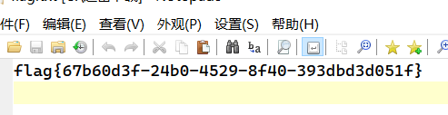

# [GKCTF 2021]easycms

【文件上传、文件下载、命令执行】

打开题目在主页面没有找到任何可利用信息，进行目录扫描发现 存在admin.php 路径文件。

访问是一个登录页面，并根据提示信息“后台密码5位弱口令”，弱口令登录进入后台。

进入页面后寻找可利用点，发现多处可上传文件，可下载文件，于是尝试利用。

**方式一**

设计 -> 主题 -> 自定义 -> 导出主题，随便输入点击保存，则会进行下载。

下载链接的后半部分可以看出是一串 base64 位编码的字符串，用工具进行解码。

解码后结果是 linux 中的路径，于是尝试构造下载链接，猜测 flag 的位置。`/flag` => base64 编码 => `L2ZsYWc=`。构造下载链接：`http://e1fa6c18-e3b5-4a4c-a540-3e1e53def9a1.node4.buuoj.cn:81/admin.php?m=ui&f=downloadtheme&theme=L2ZsYWc=`，得到 flag.zip ，但文件无法解压，后缀名改为`txt`，得到 flag 。

**方式二**

设计 -> 高级，有可修改执行的 php 代码，但保存时提示需要服务器存在`/var/www/html/system/tmp/ikuh.txt`文件。

想到之前发现的上传文件的位置，设计 -> 组件 -> 常用组件，有上传图片的地方，想用 图片马 进行探测，但是这样好像并不知道如何访问执行并利用。

转到 设计 -> 组件 -> 素材库，可上传任意文件且可进行二次编辑，此时先随意上传一个`txt`文件，通过编辑修改文件名称，有可能直接穿越到上面所需要的路径。

修改文件名称时，看 wp 直接修改为这样的路径，尝试了其他路径也均会失败。

> 此处作为小白的猜想：（做题属实是没想到，对 web 开发或 linux 目录结构还是不太了解）
>
> 
>
> 想到上方所导出的主题文件，打开可以看到目录结构
>
> 
>
> 根据这个目录结构修改文件，实现目录穿越。

最终修改的文件名称：

此时再回过头来重新保存 PHP 代码。刷新原主页便可得到 flag 。

