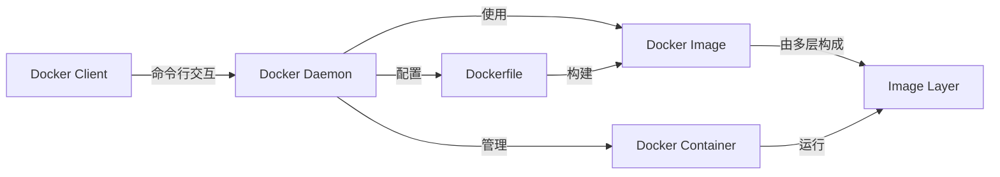

## 安装配置

### Windows 

https://blog.csdn.net/cn_ljr/article/details/132047516 （现在好像已经不适用，不需要这么麻烦，直接修改资源目录的配置即可）

### Kali

https://wiki.bafangwy.com/doc/642/

### Ubuntu

> https://www.cnblogs.com/ag-chen/p/18677273
> https://u.sb/debian-install-docker/

在 Ubuntu 中安装 Docker，添加 Docker 官方 GPG key 失败，解决方案

> https://blog.csdn.net/sunchaoyiA/article/details/81231000

### 蚁景提供的脚本

https://gitee.com/yijingsec/LinuxEnvConfig

```shell
# 查看docker服务状态
systemctl status docker
# 启动docker服务
systemctl start docker
# 开启开机自启docker服务
systemctl enable docker
```

配置国内镜像源（不稳定，经常会变）

```shell
vim /etc/docker/daemon.json
```

```json
{
	"registry-mirrors": [
		"https://docker.1ms.run",
		"https://hub.rat.dev",
		"https://docker.1panel.live"
	]
}
```

```shell
# 重新加载加速器
systemctl daemon-reload
# 重启docker
systemctl restart docker
```

给 docker 配置网络代理 https://edu.yijinglab.com/post/270

## 基础介绍

- Docker Daemon（守护进程）
	- 宿主机上运行的后台服务，负责构建、运行和分发容器；
- Docker Client（客户端）
	- 与 Daemon 的交互界面，发送请求给 Daemon 以执行命令，如构建镜像、运行容器等；
- Docker Image（镜像）
	- 只读模版，包含运行容器所需的所有内容，代码、运行时、库、环境变量、配置文件；
	- 镜像是分层的，允许共享和重用；
- Docker Container（容器）
	- 镜像的运行实例，隔离的沙盒，拥有自己的文件熊、网络设置、进程空间等。



## 常用命令

### 镜像操作

```shell
docker search mysql

# 列出本地docker镜像
docker image ls -a
docker images -a

# 拉取镜像
docker image pull docker.io/library/hello-world:latest	# [指定仓库地址]
docker pull mysql:latest	# mysql:x.x

# 删除镜像
docker image rm hello-world	# 指定镜像名
docker rmi feb5d9fea6a5		# 指定镜像ID
docker rmi mysql:5.7
```

### 容器操作

```shell
# 创建并运行容器
docker run [option] image_name [command]	# 可选参数、镜像名、启动时执行的命令
docker run -id --name=centos7 centos:centos7
# 运行，若没镜像会去远程拉取

# 创建交互式容器
docker run -it --name=mycentos centos /bin/bash
# -i 交互式 -t 分配伪终端 --name 指定名称 打开bash
# exit 退出，容器也随之停止

# 守护式容器
docker run -dit --name=mycentos centos
# -d 守护模式，在后台运行； exit 退出，容器不会停止 

# 进入正在运行的容器
docker exec -it container_name_or_id command
# exec 在已运行的容器中执行命令 容器名或ID  进入后执行的第一个命令
docker exec -it mycentos /bin/bash
docker exec my_container ls /var/www/html

# 指定端口运行
docker run -d -p 80:80 medicean/vulapps:t_thinkphp_2
# -p 端口映射 宿主机端口:容器端口 可使用多个-p做多个端口映射

# 列出正在运行的容器
docker container ls

# 列出所有容器（包括停止的）
docker container ls --all

# （简洁命令）
docker ps	# 查看存在的容器
docker ps -a

docker run -id --name=demo centos:centos7 sleep 20
# 当20s过后，这个容器就会停止

# 停止正在运行的容器
docker container stop name_or_id
docker stop name_or_id

docker rm `docker ps -a -q` -f	# 强制删除所有容器（后门指令作为前面指令的参数）
# -q 静默模式
docker rmi `docker images -q` -f

# 启动已停止的容器
docker container start name_or_id
docker start name_or_id

# 强制停止正在运行中的容器
docker container kill name_or_id
docker kill name_or_id

# 删除容器（需先停止）
docker container rm name_or_id
docker rm name_or_id

docker run -id --name centos7 -v /root/tmp:/tmp centos:7
# -v 容器文件夹和宿主机文件夹做映射，-v可以写多个，可以是文件或文件夹
```

### 容器保存为镜像

```shell
# 更改过的容器创建为一个新的镜像
docker commit container_name image_name
```

### 镜像迁移

```shell
# 给镜像打标签
docker tag 镜像id 镜像新名字（账号名/镜像名）
docker tag xxxxxxxxx userdemo/mycentos

# 推镜像到远程
docker push 镜像名

# 镜像备份与恢复
docker save -o 保存的文件名 镜像名
# 这将创建一个包含镜像及其所有层的归档文件
docker save -o mycentos.tar mycentos

# 加载与恢复
docker load -i mycentos.tar
```

## dockerfile

```dockerfile
FROM 基础镜像		# 基于哪个基础镜像来构建
MAINTAINER userDemo		# 声明镜像的创建者
ENV key value			# 设置环境变量 (可以写多条)
ENV key value			# 设置环境变量 (可以写多条)
RUN command 	     		# 说明你想干什么，在命令前加RUN即可，Dockerfile 的核心部分(可以写多条)
ADD source_dir/file dest_dir/file 	# 将宿主机的文件复制到镜像内，如果是一个压缩文件，将会在复制后自动解压，能将URL作为要拷贝的文件
COPY source_dir/file dest_dir/file 	# 和ADD相似，但是如果有压缩文件并不能解压
WORKDIR / 	# 设置工作目录 类似于cd
EXPOSE		# 对外端口
CMD   # 设置容器的启动命令，多条只有最后一条生效。可以在启动容器时被覆盖和修改
ENTRYPOINT	# 同CMD，但这个一定会被执行，不会被覆盖修改
LABEL	# 表明镜像的作者。MAINTAINER将被遗弃，被LABEL代替
ARG		# 设置只在构建过程中使用的环境变量，构建完成后，将消失
VOLUME	# 添加数据卷
USER	# 指定以哪个用户的名义执行RUN, CMD 和ENTRYPOINT等命令
```

### 示例

构建一个带 vim 的 centos:centos7 镜像,根路径下有 `/hello/ss.py` -> `ss.py` 中写 `print('hello')`

```dockerfile
FROM centos:centos7
MAINTAINER hello
ENV name hello
RUN curl -o /etc/yum.repos.d/CentOS-Base.repo http://mirrors.aliyun.com/repo/Centos-7.repo
RUN yum install vim -y
RUN mkdir /hello
RUN touch /hello/ss.py
RUN echo 'print("hello")' > /hello/ss.py
RUN echo $name
WORKDIR /hello
```

构建运行

```shell
docker build -t="mycentos" .	# 基于dockerfile构建镜像
docker run -id --name mycentos mycentos
docker run -it mycentos /bin/bash
```

### 镜像分层

dockerfile 中每执行一条命令都会保留一层，若本地有某一层，这一层就不用下载了

```shell
docker history 镜像名	# 查看镜像分层
```

### 项目部署 dockerfile 示例

```dockerfile
FROM python:3.10
MAINTAINER hello
WORKDIR /soft
COPY ./requirements.txt /soft/requirements.txt
RUN pip install -r requirements.txt -i https://pypi.doubanio.com/simple
CMD ["python","manage.py","runserver","0.0.0.0:8080"]
```

```shell
git clone xxxxxx...
docker build -t='django_books' .
docker run -id --name=books -v /root/books:/soft -p 8080:8080 django_books:latest
```

### Ubuntu&Redis

```dockerfile
FROM ubuntu:lunar-20230415
MAINTAINER hello
WORKDIR /soft
RUN apt-get update && apt-get install wget make build-essential -y
RUN wget https://github.com/redis/redis/archive/7.0.11.tar.gz && tar -xzvf 7.0.11.tar.gz
WORKDIR /soft/redis-7.0.11
RUN make && make install
EXPOSE 6379
CMD ["redis-server","./redis.conf"]
```

## docker-compose

定义和运行多容器 Docker 应用程序，批量管理

```shell
docker-compose up		# 会自动搜索当前路径下的 docker-compose.yml文件
docker-compose -f 指定文件 up
docker-compose up -d  	# 后台执行，一般我们看日志输出，不用这个

docker-compose stop  	# 停止，不会删除容器和镜像
docker-compose down 	# 停止，并删除关联的容器
docker-compose start  	# 启动yml文件管理的容器
docker-compose ps    	# 正在运行的容器
docker-compose images 	# docker-compose管理的镜像

docker-compose exec yml文件中写的service /bin/bash  # 进入到容器内

docker-compose up -d --build # 启动容器但是重新构建镜像，基于重新构建的镜像启动
```

### 示例

docker-compose 部署flask

```python
from flask import Flask
from redis import Redis
import os

app = Flask(__name__)
# redis = Redis(host=os.environ.get('REDIS_HOST', '127.0.0.1'), port=6379)
redis = Redis(host='redis', port=6379, decode_responses=True) 
# 容器的主机名，flask容器和redis容器是能ping通的，可以通过ip ping 也可以通过主机名ping

@app.route('/')
def hello():
    redis.incr('hits')
    return '你好! 查看 %s 次\n' % (redis.get('hits'))


if __name__ == "__main__":
    app.run(host="0.0.0.0", port=5000, debug=True)
```

```dockerfile
FROM python:3.11
WORKDIR /app
COPY . /app
RUN pip install -r requirements.txt -i https://pypi.tuna.tsinghua.edu.cn/simple
EXPOSE 5000
CMD [ "python", "app.py" ]
```

```yaml
version: "3"
services:
  redis:
    image: redis
  web:
    build:
      context: .
      dockerfile: Dockerfile
    ports:
      - 8080:5000
    environment:
      REDIS_HOST: redis
```

```shell
docker-compose up -d
```

## 其他

```shell
docker inspect mycentos	# 容器的详细描述
docker inspect mycentos --format='{{.NetworkSettings.Networks.bridge.IPAddress}}'	# 查看指定容器的ip地址

docker login	# 登录账号

docker log 容器名/id		# 查看镜像运行成容器时的日志
```

daemon.json 文件中添加私有仓库地址，并推送

```shell
vi /etc/docker/daemon.json
{
	"insecure-registries":["xx.xx.xx.xx:xxxx"]
} 

# 把某个镜像tag成私有仓库的镜像
docker tag 镜像名字/id xx.xx.xx.xx:xxxx/django_books:v1
docker push xx.xx.xx.xx:xxxx/django_books:v1
docker pull xx.xx.xx.xx:xxxx/django_books:v1
```
