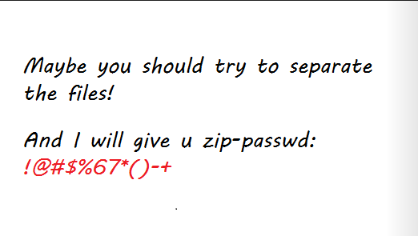

# [MRCTF2020]Hello_ misc

下载题目，解压后有两个文件，其中 flag.rar 文件需要密码才能解压，另一个图片 try to restore it.png 看起来就有猫腻，应该是对 flag.rar 文件解压密码的相关提示。

于是对图片进行分析，用 010 打开没有发现什么有价值的东西，再用 Stegsolve 打开，可以发现在 Red 处有不同的地方，应该会是提示信息，进行数据提取。


可以发现是一个  png 图片，保存为 png 图片后打开可以看到提示信息。



根据提示，有一个 zip 文件的密码为`!@#$%67*()-+`，于是对 try to restore it.png 文件进行分析。binwalk 扫描发现 zip 文件，foremost 分离文件。


解压分离出来的 zip 文件后，打开发现一些十进制数


将其转换为二进制，可以发现除了前两外有不同外，后面六位都相同，应该是前两位有文章。

因此转换为二进制后取前两位，以四个两位二进制为一组转换为十进制，再转换为字符，得到 rar 文件密码。

```python
with open("out.txt") as a_file:
    content = [x.strip()
               for x in a_file.readlines()]  # 读取文件中的所有行，并去除首位的字符存入列表中
bins = []
for i in content:
    bins.append(bin(int(i))[2:].zfill(8)
                [:2])  #  将列表中的所有元素转换为二进制，指定其长度为8，右对齐前方不足添0，仅取前两位添加至新的列表
stringBins = ''.join(bins)  # 将列表中的元素连接起来作为字符串
num = 0
flag = ''
for i in range(int(len(stringBins) / 8)):	# 以四个两位二进制为一组
    flag += chr(int(stringBins[num:num + 8], 2))    # 将对应二进制元素转换为十进制，再转字符再拼接
    num += 8

print(flag)

# rar-passwd:0ac1fe6b77be5dbe
```

解压后得到一个 zip 文件，（这里我对其再进行解压没有发现什么东西），网上说很明显这是一个 word 文档？？？没有搜到相关 word 文档变 zip 格式后的特征，可能是因为看到里面那些文件夹就可以判断是 word 文档了吧！？


将后缀名改为 docx ，打开后里面就一句话 Where is the flag ? ，八成是隐藏了吧！全选，将文字改为其他颜色看到下面出现一些字符串。


看 wp 说是 base64 解码，用脚本将每一行分别解码并输出：

```python
import base64

with open("./flag.txt",'r') as flag_file:
    content = [x.strip() for x in flag_file.readlines()]

for i in range(len(content)):
    print(str(base64.b64decode(content[i]),'utf8'))
```


将解码出来的结果所有的`1`替换为`空格`。

```python
import base64

with open('flag.txt','r') as flag_file:
    for i in flag_file.readlines():
        line = str(base64.b64decode(i),'utf8')
        print(line.replace('1', ' '))
```


得到 flag ：`flag{He1Lo_mi5c~}`

看过 wp 不禁感慨，这 TM 能做出来？！牛！

#### 补充

在将 out.zip 解压后得到一堆数字时，在个人的思路上“直接对其进行二进制转换发现前两位不同”感觉需要一些脑洞吧！在网上看到另一种解释觉得比较合理：

> 解压后得到一堆数字，仔细观察发现只有63，127，191，225这四种，很明显是 TTL ，转成文字
>
> 【TTL(Time-To-Live)指解析记录在本地DNS服务器中的缓存时间。】
>
> ```python
> import re
> 
> txt = open("out.txt",'r')
> line = txt.readlines()
> number = []
> flag = ""
> for i in line:
>     number.append(int(i))
> for i in number:
>     if(i == 63):
>         flag += "00"
>     elif(i == 127):
>         flag += "01"
>     elif(i == 191):
>         flag += "10"
>     else:
>         flag += "11"
> strr = re.findall(r'.{8}', flag) # 正则匹配flag中的任意字符，仅匹配8个
> for i in strr:
>     print(chr(int(i,2)),end="")
> ```
>
> 然后得到密码：0ac1fe6b77be5dbe


另一种得出密码的代码编写方式（大同小异吧！有个别函数不同可以作为小白学习编写）：

> 使用Python将前两位提取提取出来，并以四个两位二进制一组，转为十进制，再转为字符
>
> ```python
> with open('out.txt','r') as Dec:
>     res = ''
>     for i in Dec.readlines():
>         Bin = '{:08b}'.format(int(i))
>         print(Bin)
>         Sub_Bin = Bin[:-6]
>         res += Sub_Bin
>     print(res)
> 
>     for j in range(0,len(res),8):
>         full_bin = res[j:j+8]
>         print(chr(int(full_bin,2)),end="")
> ```

以上代码均为 wp 上编写的，作为个人借鉴学习。


> 参考：
>
> https://blog.csdn.net/weixin_45485719/article/details/107642970
>
> https://www.cnblogs.com/vuclw/p/15856245.html
>
> https://www.shawroot.cc/639.html#MRCTF2020Hello_misc