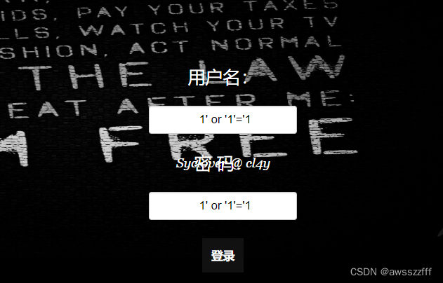

# [极客大挑战 2019]EasySQL
【SQL注入】
根据题目EasySQL提示可知此题为SQL注入的题，因此打开题目网址直接进行SQL注入尝试
先将两个位置都输入`1'`进行测试：

发现页面有报错信息

很显然它可能是一个简单的字符型注入
尝试用万能密码进行登录：`1' or  '1'='1' --+`，但依旧报错

可能是过滤掉了注释，使注释无法正常注入，那就直接进行拼接。猜测是单引号闭合，因此直接用单引号进行简单的拼接（经过输入可以判断应该是密码输入处的问题，所以只需要在密码框中输入拼接语句即可）

成功得到flag

