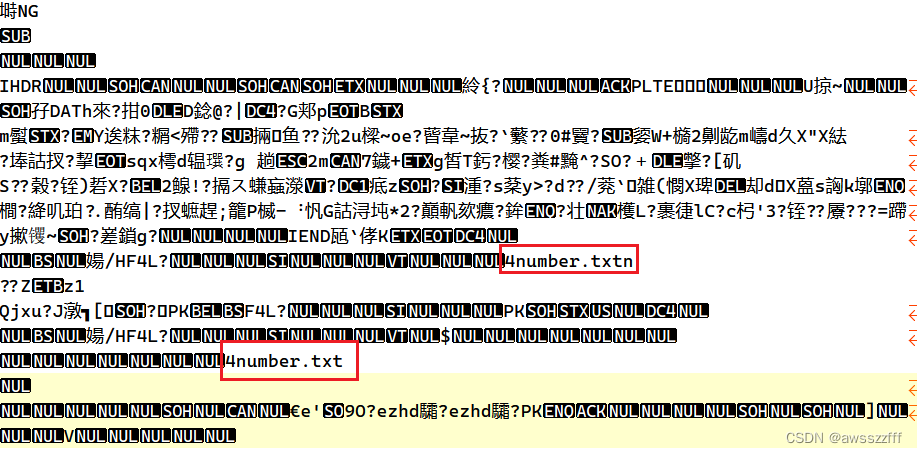
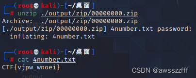
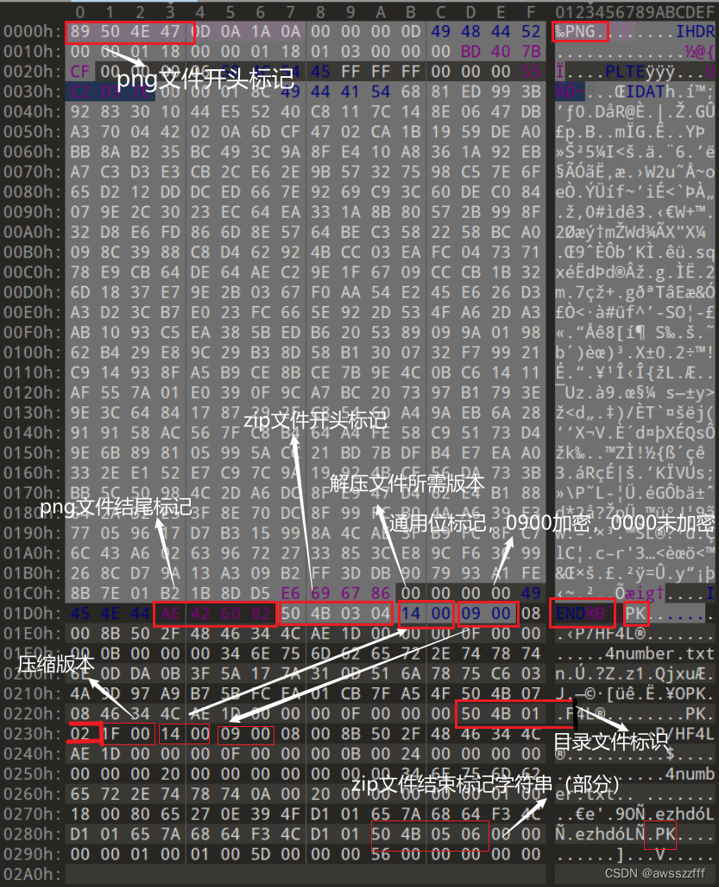

# BUUCTF_二维码

下载题目是个二维码，先用 **QR Research** 进行扫描看看是什么，结果显示 secret is here ，这应该是一个提示，但好像也没什么用~


尝试用记事本打开，观察一下有没有可用的信息，在其中发现了存在`.txt`文件隐藏（这里也可以拖进 010 或 WinHex 中查看，但本道题都发现的是这两个点）。

由于图片中含有文件，因此用 binwalk 或 foremost 进行扫描分解。



用 **foremost** 进行分解，产生了一个 zip 压缩文件，才看里面的文件内容需要密码，用 **fcrackzip** 进行破解。


由于 zip 文件中存在文件 4number.txt 猜想密码应该是四位数字。


得到密码，并查看文件得到 flag 。


#### 补充

**用其他工具进行操作：**

**binwalk** 分离文件，**ziperello** 破解密码。


**fcrackzip参数：**

```txt
-b：			使用暴力破解
-c 1：			使用字符集，1指数字集合
-l 4-4：		指定密码长度，最小长度-最大长度
-u：			不显示错误密码，仅显示最终正确密码
```

**010 对 png 的分析：**




>参考：
>http://t.csdn.cn/q9sEz
>http://t.csdn.cn/zQI8j