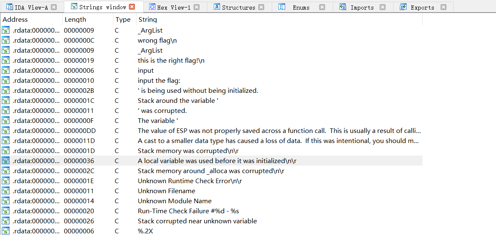

# reverse1
下载题目用 IDA64 打开，Shift + F12 查看字符串视图。



Ctrl + F 搜索 flag 。


双击第二行 “this is the right flag!” 找到这段字符串的位置。


再点击图中的那一行，Ctrl + X 。（跳转到选定的交叉引用）


随后 F5 查看伪代码。


```asm
sub_1400111D1("input the flag:");
sub_14001128F("%20s", Str1);	// 输入str1的值
v3 = j_strlen(Str2);
if ( !strncmp(Str1, Str2, v3) )	// 将str1与str2两字符串的前v3位数做比较，若str1=str2，返回0，> 返回正数，< 返回负数
	sub_1400111D1("this is the right flag!\n");	// 输出
else
	sub_1400111D1("wrong flag\n");
sub_14001113B(v5, &unk_140019D00);
return 0i64;
```

要比较 str1 与 str2 的值，只有两个相等才会输出 right flag ，str1 为用户输入的内容，str2 应该是程序中给定的，双击 str2 查看。


本以为这就是 flag 但是错误，继续分析代码

```asm
for ( j = 0; ; ++j )
{
    v8 = j;
    v2 = j_strlen(Str2);
    if ( v8 > v2 )
    	break;
    if ( Str2[j] == 111 )	// 将str2中，ASCII码为111的内容替换为48
    	Str2[j] = 48;
}
```

在 IDA 中按 R 可将选中的数字转为字符。


即将所有的 “o” 都替换为 “0” 。
最终 flag 为 flag{hell0_w0rld} 。

>学习参考：
>http://t.csdn.cn/Lm573