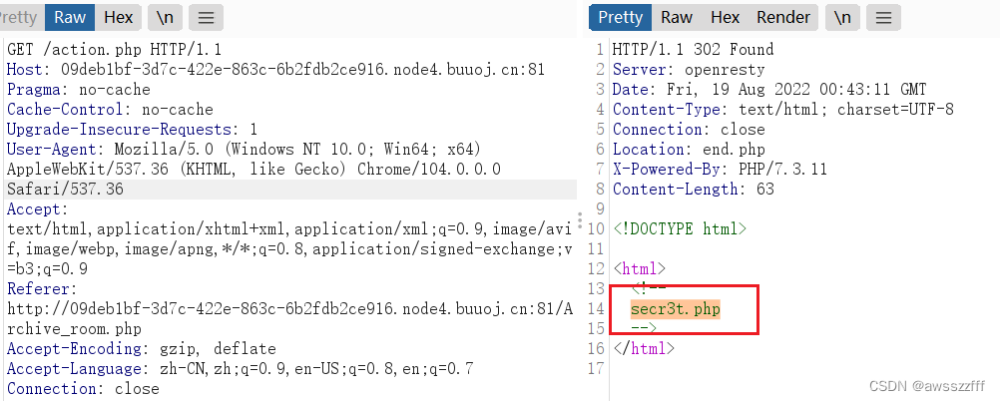

# [极客大挑战 2019]Secret File

【文件包含】

打开题目看见只是一个简单的页面，也没有什么信息，F12 先查看一下源码，发现有提示文件。


跟随文件打开新的页面，有一个按钮，点击后跳转，F12 查看 源代码 或 NetWork 可以发现，按钮所指向的文件是 action.php ，而页面展示的是 end.php ，并且 action.php HTTP 请求头里可以看出是 302 重定向。

根据页面提示以及分析容易判断中间肯定是有文件的。


BurpSuite抓包，repeater 发送，发现新的提示文件，再次用浏览器打开。



打开后看到 php 代码，进行简单的分析：

```php
    highlight_file(__FILE__);
    error_reporting(0);
    $file=$_GET['file'];
    // 传入参数中过滤掉 ../ tp input data
    // strstr — 查找字符串的首次出现（区分大小写）
    // stristr — 查找字符串的首次出现（不区分大小写）
    if(strstr($file,"../")||stristr($file, "tp")||stristr($file,"input")||stristr($file,"data")){
        echo "Oh no!";
        exit();
    }
    include($file); 
//flag放在了flag.php里
```
于是尝试传入参数 `?file=flag.php`，出现新的页面，提示到 “flag 就在下面但是看不到” ，先猜测背景色覆盖，尝试将背景色改为透明但并没有什么效果。


既然前端页面无 flag 但他说就在这！？那么应该就在 php 源码里，尝试用 php 伪协议获取源码。

```txt
?file=php://filter/read=convert.base64-encode/resource=flag.php
```

得到 base64 编码的数据，解码得到 flag。


**注：** PHP伪协议还有很多……