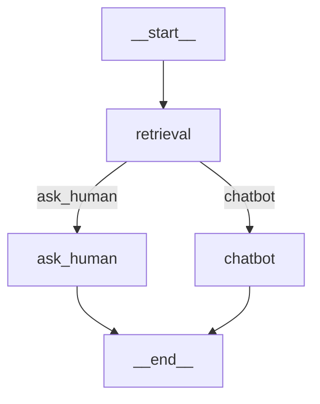

> https://langchain-ai.github.io/langgraph/

# Agent

## 构建简单的问答流程

```python
from config.load_key import load_key  
from langchain_community.chat_models import ChatTongyi  
  
llm = ChatTongyi(  
    model="qwen-plus",  
    api_key=load_key("BAILIAN_API_KEY"),  
)  
  
from langgraph.prebuilt import create_react_agent  
  
agent = create_react_agent(  
    model=llm,  
    tools=[],  
    prompt="You are a helpful assistant"  
)  
  
agent.invoke({"messages": [{"role": "user", "content": "What is the meaning of life?"}]})

# 选择流式输出
for chunk in agent.stream(  
        {"messages": [{"role": "user", "content": "What is the meaning of life?"}]},  
        stream_mode="messages"  
):  
    print(chunk)  
    print("\n")
```

stream_mode 有三种选项：

- updates：流式输出每个工具调用的每个步骤
- messages：流式输出大语言模型回复的Token
- values：一次拿到所有的 chunk （默认）
- custom：自定义输出。可在工具内部使用 get_stream_write 获取输入流，添加自定义内容

## Agent Tools 的使用

```python
import datetime  
def get_current_date():  
    """获取今天日期"""  
    return datetime.datetime.today().strftime("%Y-%m-%d")  
  
agent = create_react_agent(  
    model=llm,  
    tools=[get_current_date],  
    prompt="You are a helpful assistant"  
)  
  
agent.invoke({"messages": [{"role": "user", "content": "Time?"}]})
```

示例：

```python
from langchain_core.tools import tool  
from langgraph.prebuilt import ToolNode  
  
  
# return_direct=True 表示不让大模型推理，直接返回结果
@tool("devide_tool", return_direct=True)  
def devide(a: int, b: int) -> float:  
    """计算两个整数的除法  
    Args:        
    	a (int): 除数  
        b (int): 被除数"""  
  
    # 自定义错误  
    if b == 1:  
        raise ValueError("除数不能为1")  
    return a / b  
  
  
print(devide.name)  # devide_tool  
print(devide.description)  
# 计算两个整数的除法  
#    Args:  
#        a (int): 除数  
#        b (int): 被除数  
print(devide.args)  # {'a': {'title': 'A', 'type': 'integer'}, 'b': {'title': 'B', 'type': 'integer'}}

# 定义工具调用错误处理函数  
def handle_tool_error(error: Exception) -> str:  
    """处理工具调用错误  
    Args:        
    	error (Exception): 工具调用错误"""  
    if isinstance(error, ValueError):  
        return "除数不能为1"  
    elif isinstance(error, ZeroDivisionError):  
        return "除数不能为0"  
    return f"工具调用错误：{error}"  
  
# 创建工具节点，包含自定义工具‘devide’和错误处理函数
tool_node = ToolNode(  
    [devide],  
    handle_tool_errors=handle_tool_error  
)  

# 创建带有错误处理能力的智能代理
agent_with_error_handler = create_react_agent(  
    model=llm,  
    tools=tool_node,  
    # prompt="You are a helpful assistant"  
)  

# 调用代理处理用户输入
result = agent_with_error_handler.invoke({"messages": [{"role": "user", "content": "10除以5"}]})  
# 打印最后的返回结果  
print(result["messages"][-1].content)  # 2.0
print(result)
```

## 增加消息记忆

LangChain 中需自定义 ChatMessageHistory 并自行保存每轮消息记录，在调用模型时，将其作为参数传入。

LangGraph 将其封装在了 Agent 中，消息记忆分为长期记忆和短期记忆

- 短期记忆，Agent 内部的记忆，用当前对话的历史记忆消息。LangGraph 将其封装成 CheckPoint （当前窗口）
- 长期记忆，Agent 外部的记忆，用第三方存储长久的保存用户级别或应用级别的聊天信息。LangGraph 将其封装成 Store （多个窗口总和）

![[attachments/20250722.png]]

### 短期记忆 CheckPoint

在 LangGraph 的 Agent 中，只需要指定 checkpointer 属性，就可以实现短期记忆。具体传⼊的属性需要是 BaseCheckpointSaver 的⼦类。

checkpointer 使用时需要单独指定 thread_id 来区分不同对话

```python
from config.load_key import load_key  
from langchain_community.chat_models import ChatTongyi  
  
llm = ChatTongyi(  
    model="qwen-plus",  
    api_key=load_key("BAILIAN_API_KEY"),  
)

from langgraph.checkpoint.memory import InMemorySaver  
from langgraph.prebuilt import create_react_agent  
  
# 初始化内存检查点，用于保存对话的中间状态  
checkpoint = InMemorySaver()  
  
  
def get_weather(city: str) -> str:  
    """获取某个城市的天气"""  
    return f"城市{city}, 天气挺好"  
  
# 创建React Agent 实例  
agent = create_react_agent(  
    model=llm,  
    tools=[get_weather],  
    checkpointer=checkpoint,    # 使用内存检查点保存对话状态  
)  
  
# 配置参数，用于指定线程ID（对话ID）  
config = {  
    "configurable": {  
        "thread_id": "1"    # 设置线程ID，用于保存/恢复对话状态  
    }  
}  
  
cs_response = agent.invoke(  
    {"messages": [{"role": "user", "content": "今天在杭州的天气如何？"}]},  
    config  # 配置参数，包含线程ID  
)  
  
print(cs_response)  
  
bj_response = agent.invoke(  
    {"messages": [{"role": "user", "content": "今天在北京的天气如何？"}]},  
    config  
)  
print(bj_response)
```

为防止历史消息过多，需要对历史做一定的处理。

LangGraph 的 Agent 中有 pre_model_hook 属性，可以在每次调用大模型之前触发，通过这个 hook 管理短期记忆。

两种管理短期记忆的方式：

- Summarization 总结：用大模型的方式，对短期记忆进行总结，然后再把总结结果作为新的短期记忆

```python
from langmem.short_term import SummarizationNode  
from langchain_core.messages.utils import count_tokens_approximately    # 用于估算token数量  
from langgraph.prebuilt import create_react_agent  
from langgraph.prebuilt.chat_agent_executor import AgentState   # Agent状态定义  
from langgraph.checkpoint.memory import InMemorySaver  
from typing import Any

# 创建一个总结节点  
summarization_node = SummarizationNode(  
    token_counter=count_tokens_approximately,   # 用于估算token数量  
    model=llm,  
    max_tokens=384, # 最大上下文token数量，超过则触发总结  
    max_summary_tokens=128, # 总结后最大token数量  
    output_messages_key="llm_input_messages"    # 输出总结后的内容到指定字段  
)

# 自定义Agent状态类  
class State(AgentState):  
    # 该状态管理器用于保存上次总结的结果，防止每次调用大模型时，都重新总结历史  
    context: dict[str, Any]

# 创建 Agent
agent = create_react_agent(
    model=llm,
    tools=[get_weather],
    pre_model_hook=summarization_node,
    state_schema=State,
    checkpointer=checkpointer,
)

# 配置线程 ID（对话 ID）
config = {"configurable": {"thread_id": "1"}}

# 调用 Agent
response = agent.invoke(
    {"messages": [{"role": "user", "content": "今天的天气如何？"}]},
    config
)

# 输出最终结果
print(response["messages"][-1].content)
```

- Trimming 删除：直接把短期记忆中最旧的消息删除

```python
from langchain_core.messages.utils import (count_tokens_approximately, trim_messages)  
from langgraph.prebuilt import create_react_agent  
  
# 在调用LLM之前执行钩子函数，用于裁剪过长的消息历史
def pre_model_hook(state):  
    trimmed_messages = trim_messages(  
        state["message"],  # 当前Agent的状态
        strategy="last",  # 裁剪策略：保留最后的N条消息  
        token_conter=count_tokens_approximately,  
        max_tokens=1024,  
        start_on="human",  # 裁剪后第一条消息必须是HumanMessage  
        end_on=("human", "tool")  # 裁剪后最后一条消息必须是HumanMessage或者ToolMessage  
    )  
    # 返回裁剪后的消息  
    return {"llm_input_messages": trimmed_messages}  
  
  
checkpointer = InMemorySaver()  
agent = create_react_agent(  
    model=llm,  
    tools=[get_weather],  
    pre_model_hook=pre_model_hook,  
    checkpointer=checkpointer,  
)
```

状态管理机制，保存处理过程中的中间结果

```python
from typing import Annotated  
from langgraph.prebuilt import InjectedState, create_react_agent  
from langgraph.prebuilt.chat_agent_executor import AgentState  
from langchain_core.tools import tool  
  
  
# 自定义Agent状态类  
class CustomState(AgentState):  
    user_id: str  # 保存用户ID，供工具使用  
  
  
@tool(return_direct=True)  
def get_user_info(state: Annotated[CustomState, InjectedState]) -> str:  
    """查询用户信息"""  
    user_id = state["user_id"]  
    return "user_123 是 Agent" if user_id == "user_123" else "用户不存在"  
  
  
agent = create_react_agent(  
    model=llm,  
    tools=[get_user_info],  
    state_schema=CustomState,  # 指定Agent状态类  
)  
  
agent.invoke({  
    "messages": "查询用户信息",  
    "user_id": "user_123"  # 自定义字段，用于工具使用  
})
```

### 长期记忆

和短期记忆差不多，主要通过 Agent 的 store 属性指定，通过 namespace 来区分不同的命名空间

```python
from langchain_core.runnables import RunnableConfig  
from langgraph.config import get_store  
from langgraph.prebuilt import create_react_agent  
from langgraph.store.memory import InMemoryStore  
from langchain_core.tools import tool  
  
# 定义长期存储  
store = InMemoryStore()  
# 添加一个测试用户数据到存储中  
store.put(  
    ("users",), # 命名空间（类似数据库的表）  
    "user_123", # key  
    {           # value  
        "name": "Agent",  
        "age": "33"  
    }  
)  
  
  
# 定义工具  
@tool(return_direct=True)  
def get_user_info(user_id: str) -> str:  
    """查询用户信息"""  
    # 获取长期存储组件  
    store = get_store()  
    # 从配置中提取user_id  
    user_id = config["configurable"].get("user_id")  
    user_info = store.get(("users",), user_id)  
    return str(user_info.value) if user_info else "用户不存在"  
  
  
agent = create_react_agent(  
    model=llm,  
    tools=[get_user_info],  
    store=store,  # 配置长期存储组件，用于跨对话保存和读取数据  
)  
  
agent.invoke(  
    {"messages": [{"role": "user", "content": "查询用户信息"}]},  
    config={  
        "configurable": {"user_id": "user_123"}  # 自定义字段，用于工具使用  
    }  
)
```

## Human-in-the-loop 人类监督

Agent 调用工具完全由其自己决定，Human-in-the-loop 允许在工具调用的过程中用户进行监督。需要中断当前任务，等待用户输入，再重新恢复任务。

![[attachments/20250722-1.png]]

interrupt 方法添加人类监督，监督时需要中断当前任务，所以通常是和 stream 流式方法配合使用。

```python
from langgraph.checkpoint.memory import InMemorySaver  
from langgraph.types import interrupt  # 在执行某个工具前，插入中断点，等待用户确认或修改参数  
from langgraph.prebuilt import create_react_agent  
from langchain_core.tools import tool  
  
  
@tool(return_direct=True)  
def book_hotel(hotel_name: str):  
    """预定宾馆"""  
    response = interrupt(  
        f"正准备执行‘book_hotel’工具预定宾馆，相关参数名：{{'hotel_name': {hotel_name}}}"  
        "请选择OK，表示同意，或edit，提出补充意见。"  
    )  
    if response["type"] == "OK":  
        pass  
    elif response["type"] == "edit":  
        hotel_name = response["args"]["hotel_name"]  
    else:  
        raise ValueError(f"Unknown response type:{response['type']}")  
    return f"已预定{hotel_name}成功"  
  
  
checkpointer = InMemorySaver()  
  
agent = create_react_agent(  
    model=llm,  
    tools=[book_hotel],  
    checkpointer=checkpointer,  
)  
  
config = {  
    "configurable": {  
        "thread_id": "1"  # 线程ID，用于保存/恢复对话状态  
    }  
}  
  
for chunk in agent.stream(  
        {"messages": [{"role": "user", "content": "帮我在图灵宾馆预定一个房间"}]},  
        config  
):  
    print(chunk)  
    print("---")
```

> interrupt 只有在工具即将被执行时才会触发。eg：若 content 的内容是 帮我预定一个宾馆 ，Agent 认为信息不够具体，所以它先询问你想预定哪个酒店，而不是直接调用 book_hotel 工具。则不会触发 interrupt 。

执行完工具后，输出 Interrupt 响应，等待用户输入确认。随后通过提交 Command 请求，继续完成之前的任务。

```python
from langgraph.types import Command  
  
for chunk in agent.stream(  
 		# Command(resume={"type": "OK"}),
        Command(resume={"type": "edit", "args": {"hotel_name": "Hello宾馆"}}),  
        config  
):  
    print(chunk)  
    print(chunk["tools"]["messages"][-1].content)  
    print("---")
```

# Graph

## 构建 Graph

Graph 用来描述任务之间的依赖关系，主要包含三个基本元素：

- State：在整个应用中共享的一种数据结构
- Node：一个处理数据的节点，通常为一个函数，以 State 作为输入，经过操作后，返回更新后的 State
- Edge：表示 Node 之间的依赖关系，通常为一个函数，根据当前 State 来决定接下来执行哪个 Node

示例 1 ：

```python
from typing import TypedDict  
from langgraph.constants import END, START  # 图的开始和结束节点常量  
from langgraph.graph import StateGraph  # 状态图构建器  

  
# 定义输入状态类型 - 这是图接收的初始输入格式  
class InputState(TypedDict):  
    user_input: str  # 输入状态只包含用户输入字符串  
  
# 定义输出状态类型 - 这是图返回的输出格式  
class OutputState(TypedDict):  
    graph_output: str   # 输出状态只包含图最终输出的字符串  
  
# 定义整体状态类型 - 这是图中所有节点共享的完整状态  
class OverallState(TypedDict):  
    foo: str    # node_1产生的中间状态  
    user_input: str # 用户输入（从InputState继承）  
    graph_output: str   # 最终输出（从OutputState继承）  
  
# 定义私有状态类型 - 只在特定节点间传递的临时状态  
class PrivateState(TypedDict):  
    bar: str    # node_2产生的中间状态  
  
# 节点1函数：处理用户输入，生成foo字段  
def node_1(state: InputState) -> OverallState:  
    # 将用户输入加上">学习"的后缀，存储在foo字段中  
    return {"foo": state["user_input"] + ">学习"}  
  
# 节点2函数：处理foo字段，生成bar字段  
def node_2(state: OverallState) -> PrivateState:  
    return {"bar": state["foo"] + ">天天"}  
  
  
def node_3(state: PrivateState) -> OutputState:  
    return {"graph_output": state["bar"] + ">向上"}  
  
# 创建状态图构建器  
builder = StateGraph(OverallState, input_schema=InputState, output_schema=OutputState)  
  
# 添加节点  
builder.add_node("node_1", node_1)  # 节点名，节点函数  
builder.add_node("node_2", node_2)  
builder.add_node("node_3", node_3)  
  
# 添加边  
builder.add_edge(START, "node_1")  
builder.add_edge("node_1", "node_2")  
builder.add_edge("node_2", "node_3")  
builder.add_edge("node_3", END)  
  
# 编译图，生成可执行的图对象（Runnable对象）  
graph = builder.compile()  
  
# 执行图，传入初始输入  
graph.invoke({"user_input": "hello"})
# {'graph_output': 'hello>学习>天天>向上'}
```

示例 2 ：

```python
from typing import Annotated  # 用于添加类型注解
from typing_extensions import TypedDict  # 用于定义结构化类型

from langgraph.graph import StateGraph, START, END  # StateGraph: 状态图类, START/END: 图的起始和结束节点
from langgraph.graph.message import add_messages  # 用于处理消息列表的合并函数
# from langgraph.graph import MessagesState

# 定义 State 类型，继承自 TypedDict
class State(TypedDict):
    # 定义状态中的 messages 字段
    # - 类型是 list (消息列表)
    # - add_messages 是更新函数，当新状态到来时，会将新消息追加到现有消息列表中
    messages: Annotated[list, add_messages]

# 创建状态图构建器实例
# StateGraph 是一个有状态的图结构，State 参数定义了图中节点间传递的状态结构
graph_builder = StateGraph(State)
# graph_builder = StateGraph(MessagesState)	# MessagesState可以理解为同上面State的定义

# 注释掉的代码是使用 OpenAI GPT 模型的示例
from langchain.chat_models import init_chat_model
llm = init_chat_model("gpt-4o", model_provider="openai")

# 定义一个执行节点函数，用于处理用户输入并生成 AI 回复
# 输入参数是 State 类型，包含对话历史消息
# 返回值是一个字典，包含新的消息列表
def chatbot(state: State):
    # 调用大语言模型处理当前对话历史，并将模型回复包装成消息列表返回
    # 返回值会触发状态更新 add_messages，将新消息追加到现有消息列表中
    return {"messages": [llm.invoke(state["messages"])]}

# 向图中添加一个名为 "chatbot" 的节点，该节点执行 chatbot 函数
graph_builder.add_node("chatbot", chatbot)

# 添加从 START 节点到 "chatbot" 节点的边，表示工作流开始后执行 chatbot 节点
graph_builder.add_edge(START, "chatbot")

# 添加从 "chatbot" 节点到 END 节点的边，表示 chatbot 节点执行完成后工作流结束
graph_builder.add_edge("chatbot", END)

# 编译图结构，生成可执行的图对象
graph = graph_builder.compile()

# 导入 AIMessage 类，用于识别 AI 生成的消息
from langchain.schema import AIMessage

def stream_graph_updates(user_input: str):
    # 向 graph 传入用户输入消息，触发工作流执行
    # 以流式方式执行图，可以逐步获取输出结果
    for event in graph.stream({"messages": [{"role": "user", "content": user_input}]}):
        # 遍历每个事件的输出值
        for value in event.values():
            # 检查返回值中是否包含 "messages" 键，
            # 并且最后一条消息是 AI 生成的消息 (AIMessage 类型)
            if "messages" in value and isinstance(value["messages"][-1], AIMessage):
                print("Assistant:", value["messages"][-1].content)


def run():
    # 执行这个交互式聊天工作流
    while True:
        # 获取用户输入
        user_input = input("User: ")
        # 如果用户输入为空，则退出循环
        if user_input.strip() == "":
            break

        # 调用 stream_graph_updates 函数处理用户输入并输出 AI 回复
        stream_graph_updates(user_input)
run()
```

```python
# 查看上方所构建的图结构
from IPython.display import Image, display

try:
    # graph.get_graph() 获取图结构
    # draw_mermaid_png() 生成图的 Mermaid PNG 可视化图像
    display(Image(data=graph.get_graph().draw_mermaid_png()))
except Exception as e:
    # 如果可视化过程中出现任何异常，打印错误信息
    print(e)
```

### State 状态

State 所有节点共享的状态，一个字典，包含了所有节点的状态

- State 形式上，可以是 TypedDict 字典，也可以是 Pydantic 中的一个 BaseModel （本质上没有太多区别）。eg：

```python
from pydantic import BaseModel

class OverallState(BaseModel):
	a: str
```

- State 中定义的属性，通常不需要指定默认值，若需要默认值，可通过在 START 节点后，定义一个 node 来指定。eg：

```python
def node(state: OverallState):
	return {"a": "goodbye"}
```

- State 中的属性，除了可修改值外，也可以定义一些操作，来指定如何更新 State 中的值。eg：

```python
from langgraph.graph.message import add_messages  
from typing import TypedDict, Annotated, List  
from langchain_core.messages import AnyMessage  
from operator import add
  
  
# 定义状态结构类型  
class State(TypedDict):  
    # 消息列表字段，使用add_messages进行合并（追加而不是替换）  
    messages: Annotated[list[AnyMessage], add_messages]  
    # 整数列表字段，使用add进行合并（列表连接）  
    list_field: Annotated[list[int], add]  
    # 字符串字段，使用默认合并（直接覆盖）  
    extra_field: str
```

此时，若有一个 node ，返回了 State 中更新的值，那么 messages 和 list_fild 的值就会添加到原有的旧集合中，而 extra_field 的值会被替换。

```python
from langgraph.graph import StateGraph  
from langgraph.graph.message import add_messages    # 消息列表合并函数  
from typing import TypedDict, Annotated  
from langchain_core.messages import AnyMessage, AIMessage  
from operator import add    # 列表连接操作符  
from langchain_core.messages import HumanMessage  
  
# 定义状态结构类型  
class State(TypedDict):  
    messages: Annotated[list[AnyMessage], add_messages]  
    list_field: Annotated[list[int], add]  
    extra_field: str  
  
  
def node1(state: State):  
    new_message = AIMessage("Hello!")  
    return {"messages": [new_message], "list_field": [10], "extra_field": 10}  
  
  
def node2(state: State):  
    new_message = AIMessage("LangGraph!")  
    return {"messages": [new_message], "list_field": [20], "extra_field": 20}  
  
# 构建并编译状态图  
graph = (StateGraph(State)  
         .add_node("node1", node1)  
         .add_node("node2", node2)  
         .set_entry_point("node1")  # 设置入口点为node1  
         .add_edge("node1", "node2")  
         .compile())  
  
# input_message = {"role": "user", "content": "Hi!"}  
input_message = HumanMessage(content="Hi!")  # AI说这应该是一个Message对象，而不是一个字典，但是上面字典传入也正常执行
  
result = graph.invoke({"messages": [input_message], "list_field": [1, 2, 3]})  
  
print(result)  
  
for message in result["messages"]:  
    message.pretty_print()  
  
print(result["extra_field"])
```

```txt
执行流程分析：  
1. 初始状态：  
   messages: [{"role": "user", "content": "Hi!"}]  
   list_field: [1, 2, 3]  
   extra_field: undefined  
2. node1执行后：  
   messages: [{"role": "user", "content": "Hi!"}, AIMessage("Hello!")]  
   list_field: [1, 2, 3, 10]  
   extra_field: 10  
  
3. node2执行后：  
   messages: [{"role": "user", "content": "Hi!"}, AIMessage("Hello!"), AIMessage("LangGraph!")]  
   list_field: [1, 2, 3, 10, 20]  
   extra_field: 20  
  
最终输出result包含所有这些字段
```

State 通常都会保存聊天消息，LangGraph 中 `langgraph.graph.MessagesState` 可以用来快速保存消息

```python
class MessagesState(TypedDict):
	messages: Annotated[list[AnyMessage], add_messages]
```

对于 Messages 可以用两种方式来声明：

```python
{"messages": [HumanMessage(content="message")]}

{"messages": [{"type": "user", "content": "message"}]}
```

### Node 节点

Node 图中处理数据的节点

- Node 通常为一个函数，接收一个 State 对象输入，返回一个 State 输出
- 每个 Node 都有唯一名称，通常为一个字符串，若没有提供名称，LangGraph 会自动生成一个和函数名相同的名称
- 通常包含两个具体参数，State 必选，配置项 config 可选 ，包含一些节点运行的配置参数
- 每个 Node 都有缓存机制，只要 Node 传入参数相同，LangGraph 就会优先从缓存中获取执行结果

```python
import time  
from typing import TypedDict  
  
from langchain_core.runnables import RunnableConfig # 可运行配置类型  
from langgraph.constants import START, END  
from langgraph.graph import StateGraph  
from langgraph.types import CachePolicy # 缓存策略类型定义  
from langgraph.cache.memory import InMemoryCache    # 内存缓存实现  
  
# 定义状态类型 - 这是图中节点间传递的数据结构  
class State(TypedDict):  
    number: int  
    user_id: str  
  
# 定义配置模式类型 - 这是图运行时接收的配置参数结构  
class ConfigSchema(TypedDict):  
    user_id: str  
  
  
def node_1(state: State, config: RunnableConfig):  
    time.sleep(3)  
    # 从配置中提取用户ID  
    # config["configurable"] 包含用户传递的可配置参数  
    user_id = config["configurable"]["user_id"]  
    return {"number": state["number"] + 1, "user_id": user_id}  
  
  
builder = StateGraph(State, config_schema=ConfigSchema)  
# 设置缓存策略，TTL为5秒  
# 这意味着相同输入的节点结果会被缓存5秒钟  
builder.add_node("node_1", node_1, cache_policy=CachePolicy(ttl=5))  
builder.add_edge(START, "node_1")  
builder.add_edge("node_1", END)  
  
# 使用内存缓存来存储节点执行结果  
graph = builder.compile(cache=InMemoryCache())  
  
print(graph.invoke({"number": 5}, config={"configurable": {"user_id": "123"}}, stream_mode="updates"))  
  
print(graph.invoke({"number": 5}, config={"configurable": {"user_id": "456"}}, stream_mode="updates"))

# [{'node_1': {'number': 6, 'user_id': '123'}}]
# [{'node_1': {'number': 6, 'user_id': '123'}, '__metadata__': {'cached': True}}]
```

- 除了缓存机制，还提供了重试机制，可针对单个节点指定，eg：

```python
from langgraph.types import RetryPolicy

builder.add_node("nodel", node_1, retry=RetryPolicy(max_attempts=4))
```

也可针对某一次任务调用指定，eg：

```python
print(graph.invoke(xxxx, config={"recursion_limit": 25}))
```

### Edge 边

通过 Edge 把 Node 连接起来，从而决定 State 应该如何在 Graph 中传递。

- 普通 Edge 和 EntryPoint

```python
builder = StateGraph(State)
builder.set_entry_point("node_1")
builder.set_finish_point("node_2")
```

- 条件 Edge 和 EntryPoint

添加带有条件判断的 Edge 和 EntryPoint ，用来动态构建更复杂的工作流程。具体可以指定一个函数，函数返回值就可以是下一个 Node 的名称

```python
from typing import TypedDict  
  
from langchain_core.runnables import RunnableConfig  
from langgraph.constants import START, END  
from langgraph.graph import StateGraph  
  
  
class State(TypedDict):  
    number: int  
  
  
def node_1(state: State, config: RunnableConfig):  
    return {"number": state["number"] + 1}  
  
  
# 创建状态图构建器，使用State类作为状态类型  
builder = StateGraph(State)  
  
builder.add_node("node_1", node_1)  
  
  
# 定义路由函数，用于条件边的判断  
# 根据当前状态中的number值决定下一步执行哪个节点  
def routing_func(state: State) -> str:  
    if state["number"] > 5:  
        return "node_1"  # 返回节点node1，表示执行该节点  
    else:  
        return END  # 否则返回END，表示结束执行  
  
  
builder.add_edge("node_1", END)  
  
# 添加条件边，根据routing_func的返回值决定流向  
builder.add_conditional_edges(START, routing_func)  
  
graph = builder.compile()  
print(graph.invoke({"number": 6}))
# {'number': 7}
```

若不想再路由函数中写入过多具体节点名称，可以在函数返回中自定义结果，然后将该结果解析到某一具体 Node 上。eg：

```python
def routing_func(state: State) -> bool:  
    if state["number"] > 5:  
        return True  
    else:  
        return False  
  
  
builder.add_conditional_edges(START, routing_func, {True: "node_a", False: "node_b"})
```

- Send 动态路由

在条件边种，若希望一个 Node 后同时路由到多个 Node ，则可以返回 Send 动态路由的方式实现。Send 对象可传入两个参数，第一个是下一个 Node 的名称，第二个是 Node 的输入。

```python
from operator import add  
from typing import TypedDict, Annotated  
  
from langgraph.constants import START, END  
from langgraph.graph import StateGraph  
from langgraph.types import Send  
  
  
class State(TypedDict):  
    messages: Annotated[list[str], add]  
  
  
class PrivateState(TypedDict):  
    msg: str  
  
  
def node_1(state: PrivateState) -> State:  
    res = state["msg"] + "!"  
    return {"messages": [res]}  
  
  
builder = StateGraph(State)  
  
builder.add_node("node_1", node_1)  
  
  
# 定义路由函数（条件边逻辑）  
def routing_func(state: State):  
    result = []  
    for message in state["messages"]:  
        result.append(Send("node_1", {"msg": message}))  
  
    return result  
  
# 添加条件边：从 START 节点根据 routing_func 的返回值决定如何路由  
# ["node_1"] 表示可能的目标节点列表  
builder.add_conditional_edges(START, routing_func, ["node_1"])  
builder.add_edge("node_1", END)  
  
graph = builder.compile()  
print(graph.invoke({"messages": ["hello", "world", "hello", "graph"]}))

# {'messages': ['hello', 'world', 'hello', 'graph', 'hello!', 'world!', 'hello!', 'graph!']}
```

- Command 命令

Graph 典型业务步骤是 State 进入一个 Node 处理，在 Node 中先更新 State 状态，再通过 Edges 传递给下一个 Node ，若希望将这两个步骤合并为一个命令，则可以使用 Command 命令。

```python
from operator import add  
from typing import TypedDict, Annotated  
  
from langgraph.constants import START, END  
from langgraph.graph import StateGraph  
from langgraph.types import Command  
  
  
class State(TypedDict):  
    messages: Annotated[list[str], add]  
  
  
def node_1(state: State):  
    new_messages = []  
    for message in state["messages"]:  
        new_messages.append(message + "!")  
    return Command(  
        goto=END,   # 指定下一步跳转的节点  
        update={"messages": new_messages},  # 指定状态更新内容  
    )  
  
  
builder = StateGraph(State)  
  
builder.add_node("node_1", node_1)  
builder.add_edge(START, "node_1")  
  
graph = builder.compile()  
print(graph.invoke({"messages": ["hello", "world", "hello", "graph"]}))
# {'messages': ['hello', 'world', 'hello', 'graph', 'hello!', 'world!', 'hello!', 'graph!']}
```

## 子图

一个 Graph 可以单独使用，也可以作为一个 Node 嵌入到另一个 Graph 中。子图的使用和 Node 没太多区别，只是当触发 SubGraph 代表的 Node 后，实际上是相当于重新调用了一个 subgraph.invoke(state) 方法。

```python
from operator import add  
from typing import TypedDict, Annotated  
  
from langgraph.constants import END  
from langgraph.graph import StateGraph, MessagesState, START  
from langgraph.types import Command  
  
  
class State(TypedDict):  
    messages: Annotated[list[str], add]  
  
# 子图节点函数  
def sub_node_1(state: State) -> MessagesState:  
    return {"messages": ["response from subgraph"]}  
  
# 子图  
subgraph_builder = StateGraph(State)  
subgraph_builder.add_node("sub_node_1", sub_node_1)  
subgraph_builder.add_edge(START, "sub_node_1")  
subgraph_builder.add_edge("sub_node_1", END)  
subgraph = subgraph_builder.compile()  
  
# 主图  
builder = StateGraph(State)  
builder.add_node("subgraph_node", subgraph)  
builder.add_edge(START, "subgraph_node")  
builder.add_edge("subgraph_node", END)  
  
graph = builder.compile()  
  
print(graph.invoke({"messages": ["hello subgraph"]}))

# {'messages': ['hello subgraph', 'hello subgraph', 'response from subgraph']}
# 结果hello subgraph会出现两次。这是因为在subgraph_node中默认调⽤了⼀次subgraph.invoke(state)⽅法。主图⾥也调⽤了⼀次invoke。这就会往state中添加两次语句
```

## 图的 Stream 支持

stream 流式调用，依次返回 State 数据处理步骤。`stream()`同步流式调用，`astream()`异步流式调用

```python
for chunk in graph.stream({"messages": ["hello subgraph"]}, stream_mode="debug"):
	print(chunk)
```

几种不同的 stream_mode：

- value：在图的每一步之后流式传输状态的完整值
- updates：在图的每一步之后，将更新内容流式传输到状态，若在统一步骤中进行多次更新（eg：运行了多个节点），这些更新将分别进行流式传输
- custom：从图节点内部流式传输自定义数据，通常用于调试
- messages：从任何大模型的图节点中，流式传输二元组（LLM 的 Token，元数据）
- debug：在图执行过程中尽可能多地传输信息

custom 模式，可以自定义输出内容，在 Node 节点或 Tools 工具内，通过 `get_stream_writer()` 获取一个 StreamWrite 对象，然后用 `write()` 将自定义数据写入流中。

```python
from typing import TypedDict  
from langgraph.config import get_stream_writer  
from langgraph.graph import StateGraph, START  
  
  
class State(TypedDict):  
    query: str  
    answer: str  
  
  
def node(state: State):  
    writer = get_stream_writer()  
    # 使用写入器发送自定义数据
    # 这些数据会在 stream_mode="custom" 模式下被输出
    writer({"自定义key": "在节点内返回自定义信息"})  
    # 节点的正常返回值
    return {"answer": "some data"}  
  
  
graph = (  
    StateGraph(State)  
    .add_node("node", node)  
    .add_edge(START, "node")  
    .add_edge("node", END)  
    .compile()  
)  
  
inputs = {"query": "hello"} 

# custom模式会捕获通过 get_stream_writer() 发送的自定义数据
for chunk in graph.stream(inputs, stream_mode="custom"):  
    print(chunk)
# {'自定义key': '在节点内返回自定义信息'}
```

构建 LLM 对象时，支持通过 disable_streaming 禁止流式输出

```python
llm = ChatOpenAI(model="", disable_streaming=True)
```

messages 模式，监控大模型 Token 记录

```python
from config.load_key import load_key  
from langchain_community.chat_models import ChatTongyi  
  
llm = ChatTongyi(  
    model="qwen-plus",  
    api_key=load_key("BAILIAN_API_KEY"),  
)  
  
from langgraph.graph import StateGraph, MessagesState, START  
  
  
def call_model(state: MessagesState):  
    response = llm.invoke(state["messages"])  
    return {"messages": response}  
  
  
builder = StateGraph(MessagesState)  
builder.add_node("call_model", call_model)  
builder.add_edge(START, "call_model")  
  
graph = builder.compile()  
for chunk in graph.stream(  
        {"messages": [{"role": "user", "content": "美国的首都是哪里"}]},  
        stream_mode="messages"  
):  
    print(chunk)
```

## 大模型消息持久化

Graph 和 Agent 的相似，都支持 checkpointer 构建短期记忆，store 构建长期记忆

```python
from config.load_key import load_key  
from langchain_community.chat_models import ChatTongyi  
  
llm = ChatTongyi(  
    model="qwen-plus",  
    api_key=load_key("BAILIAN_API_KEY"),  
)  
  
from langgraph.graph import StateGraph, MessagesState, START  
from langgraph.checkpoint.memory import InMemorySaver  # 内存检查点保存器  
  
  
def call_model(state: MessagesState):  
    response = llm.invoke(state["messages"])  
    return {"messages": response}  
  
  
builder = StateGraph(MessagesState)  
builder.add_node("call_model", call_model)  
builder.add_edge(START, "call_model")  
  
# 创建内存检查点保存器（用于会话状态持久化）  
checkpointer = InMemorySaver()  
graph = builder.compile(checkpointer=checkpointer)  
  
config = {  
    "configurable": {  
        "thread_id": "1"  
    }  
}  
  
for chunk in graph.stream(  
        {"messages": [{"role": "user", "content": "中国最好的大学是哪一所？"}]},  
        config,  # 使用相同的thread_id配置  
        stream_mode="values",  
):  
    chunk["messages"][-1].pretty_print()  
  
for chunk in graph.stream(  
        {"messages": [{"role": "user", "content": "美国呢？"}]},  
        config,  
        stream_mode="values",  
):  
    chunk["messages"][-1].pretty_print()
```

## Human-in-loop 人类干预

基本流程：

- 指定 checkpointer 短期记忆，保存任务状态
- 指定 thread_id 配置项，指定线程 ID ，便于之后通过线程 ID ，指定恢复线程
- 任务执行过程，通过 Interrupt 终端任务，等待确认
- 确认后，通过提交一个带有 resume=True 的 Command 指令，恢复任务，并继续执行

示例：

![[attachments/20250724.png]]

```python
from config.load_key import load_key  
from langchain_community.chat_models import ChatTongyi  
  
llm = ChatTongyi(  
    model="qwen-plus",  
    api_key=load_key("BAILIAN_API_KEY"),  
)  
  
from operator import add  
from langchain_core.messages import AnyMessage  
from langgraph.constants import START, END  
from langgraph.graph import StateGraph  
from langgraph.checkpoint.memory import InMemorySaver  
  
from typing import Literal, TypedDict, Annotated  
from langgraph.types import interrupt, Command  
  
  
class State(TypedDict):  
    messages: Annotated[list[AnyMessage], add]  
  
  
# 定义需要人工审核的节点函数  
def human_approval(state: State) -> Command[Literal["call_llm", END]]:  
    # interrupt 处暂定，等待人工审核输入  
    is_approved = interrupt(  
        {  
            "question": "是否同意调用大语言模型？"  
        }  
    )  
  
    if is_approved:  
        return Command(goto="call_llm")  
    else:  
        return Command(goto=END)  
  
  
# 定义调用大模型的节点函数  
def call_llm(state: State):  
    response = llm.invoke(state["messages"])  
    return {"messages": [response]}  
  
  
builder = StateGraph(State)  
  
builder.add_node("human_approval", human_approval)  
builder.add_node("call_llm", call_llm)  
builder.add_edge(START, "human_approval")  
checkpointer = InMemorySaver()  
graph = builder.compile(checkpointer=checkpointer)  
  
from langchain_core.messages import HumanMessage  
  
thread_config = {"configurable": {"thread_id": 1}}  
graph.invoke({"messages": [HumanMessage(content="What is the meaning of life?")]}, config=thread_config)  
  
# 类似人工审批通过，继续到call_llm节点  
final_result = graph.invoke(Command(resume=True), config=thread_config)  
print(final_result)  
  
# final_result = graph.invoke(Command(resume=False), config=thread_config)  
# print(final_result)
```

- 任务中断和恢复，需要保持相同的 thread_id ，通常会随机生成
- 中断任务的时间不能过长，过长了之后就无法恢复
- Command 中传递的 resume 可以是简单的 True 或 False ，也可以是⼀个字典。通过字典可以进行更多的判断。

## Time Travel 时间回溯

时间回溯，保存 Graph 运行过程，手动指定从 Graph 的某一个 Node 开始进行重演。

- 运行时，需要提供初始输入消息
- 指定线程ID
- 指定 thread_id 和 check_point_id ，进行任务重演，重演钱，可选择更新 state。

```python
from config.load_key import load_key  
from langchain_community.chat_models import ChatTongyi  
  
llm = ChatTongyi(  
    model="qwen-plus",  
    api_key=load_key("BAILIAN_API_KEY"),  
)  
  
from typing import TypedDict  
from typing_extensions import NotRequired  
from langgraph.checkpoint.memory import InMemorySaver  
from langgraph.constants import START, END  
from langgraph.graph import StateGraph  
  
  
class State(TypedDict):  
    author: NotRequired[str]  
    joke: NotRequired[str]  
  
  
def author_node(state: State):  
    prompt = "帮我推荐⼀位受⼈们欢迎的作家。只需要给出作家的名字即可。"  
    author = llm.invoke(prompt)  
    return {"author": author}  
  
  
def joke_node(state: State):  
    prompt = f"⽤作家：{state['author']} 的⻛格，写⼀个100字以内的笑话"  
    joke = llm.invoke(prompt)  
    return {"joke": joke}  
  
  
builder = StateGraph(State)  
builder.add_node(author_node)  
builder.add_node(joke_node)  
builder.add_edge(START, "author_node")  
builder.add_edge("author_node", "joke_node")  
builder.add_edge("joke_node", END)  
  
checkpointer = InMemorySaver()  
graph = builder.compile(checkpointer=checkpointer)  
  
import uuid # 用于生成唯一ID  
  
config = {  
    "configurable": {  
        "thread_id": uuid.uuid4(),  
    }  
}  
state = graph.invoke({}, config)  
print(state["author"])  
print()  
print(state["joke"])
```

```python
# 获取会话的所有状态历史记录  
states = list(graph.get_state_history(config))  
for state in states:  
    print(state.next)   # 下一步要执行的节点  
    print(state.config["configurable"]["checkpoint_id"])    # 检查点ID  
    print(state.values) # 当前状态值  
    print()
```

```python
# 选择特定历史状态进行修改  
selected_state = states[1]  # 选择倒数第二个状态  
print(selected_state.next)  
print(selected_state.values)
```

```python
# 更新历史状态  
new_config = graph.update_state(selected_state.config, values={"author": "郭德纲"})  
print(new_config)
```

```python
# 更新后的状态继续执行  
graph.invoke(None, new_config)
```

## 构建 RAG

```python
from langchain_community.embeddings import DashScopeEmbeddings  
from langchain_text_splitters import RecursiveCharacterTextSplitter  
from langchain_community.vectorstores import FAISS  
from langchain_community.document_loaders import PyMuPDFLoader  
  
# 加载文档  
loader = PyMuPDFLoader("./data/deepseek-v3-1-4.pdf")  
pages = loader.load_and_split()  
  
# 文档切分  
text_splitter = RecursiveCharacterTextSplitter(  
    chunk_size=512,  
    chunk_overlap=200,  
    length_function=len,  
    add_start_index=True,  
)  
  
texts = text_splitter.create_documents(  
    [page.page_content for page in pages[:2]]  
)  
  
# 灌库  
embeddings = DashScopeEmbeddings(model="text-embedding-v1")  
db = FAISS.from_documents(texts, embeddings)  
  
# 检索 top-5 结果  
retriever = db.as_retriever(search_kwargs={"k": 5})

from langchain.prompts import ChatPromptTemplate, HumanMessagePromptTemplate  
  
# Prompt模板  
template = """请根据对话历史和下面提供的信息回答上面用户提出的问题:  
{query}  
"""  
prompt = ChatPromptTemplate.from_messages(  
    [  
        HumanMessagePromptTemplate.from_template(template),  
    ]  
)

def retrieval(state: State):
    # 初始化用户查询变量
    user_query = ""
    
    # 检查状态中是否至少有一条消息
    if len(state["messages"]) >= 1:
        # 获取最后一轮用户输入（最新的消息）
        user_query = state["messages"][-1]
    else:
        # 如果没有消息，返回空消息列表
        return {"messages": []}
    
    # 使用检索器根据用户查询检索相关文档
    # retriever.invoke() 会返回与查询最相关的文档列表
    docs = retriever.invoke(str(user_query))
    
    # 将检索到的文档内容连接成一个字符串，用换行符分隔
    # 然后使用 prompt 模板生成消息
    # prompt.invoke() 会根据模板和输入内容生成格式化的消息
    messages = prompt.invoke("\n".join([doc.page_content for doc in docs])).messages
    
    # 返回包含生成消息的字典，这些消息将被添加到状态中
    return {"messages": messages}

# 定义一个执行节点
# 输入是 State，输出是系统回复  
def chatbot(state: State):  
    # 调用大模型，并返回消息（列表）  
    # 返回值会触发状态更新 add_messages    return {"messages": [llm.invoke(state["messages"])]}

graph_builder = StateGraph(State)  
graph_builder.add_node("retrieval", retrieval)  
graph_builder.add_node("chatbot", chatbot)  
graph_builder.add_edge(START, "retrieval")  
graph_builder.add_edge("retrieval","chatbot")  
graph_builder.add_edge("chatbot", END)  
  
graph = graph_builder.compile()

from langchain.schema import AIMessage  
  
def stream_graph_updates(user_input: str):  
    # 向 graph 传入一条消息（触发状态更新 add_messages）  
    for event in graph.stream({"messages": [{"role": "user", "content": user_input}]}):  
        for value in event.values():  
            if "messages" in value and isinstance(value["messages"][-1], AIMessage):  
                print("Assistant:", value["messages"][-1].content)  
  
def run():  
    # 执行这个工作流  
    while True:  
        user_input = input("User: ")  
        if user_input.strip() == "":  
            break  
  
        stream_graph_updates(user_input)

run()
```

### 加入分支

若找不到答案则转人工处理

```python
# 导入必要的模块
from langchain.schema import HumanMessage  # 用于创建人类消息
from typing import Literal  # 用于类型提示，限制返回值为特定字符串
from langgraph.types import interrupt, Command  # 用于中断流程和恢复命令


# 校验函数：判断是否需要转人工处理
def verify(state: State) -> Literal["chatbot", "ask_human"]:
    # 创建一条人类消息，要求判断现有信息是否足够回答用户问题
    message = HumanMessage(
        "请根据对话历史和上面提供的信息判断，已知的信息是否能够回答用户的问题。直接输出你的判断'Y'或'N'")
    
    # 调用大语言模型进行判断，将当前状态消息和判断消息一起传入
    ret = llm.invoke(state["messages"] + [message])
    
    # 如果模型回答包含'Y'，则继续由chatbot处理
    if 'Y' in ret.content:
        return "chatbot"
    else:
        # 否则转人工处理
        return "ask_human"


# 人工处理函数：当中断发生时执行人工介入
def ask_human(state: State):
    # 获取倒数第二条消息的内容（通常是用户的问题）
    user_query = state["messages"][-2].content
    
    # 使用interrupt函数中断流程，将问题传递给人工处理
    # 这会暂停图的执行，等待人工输入
    human_response = interrupt(
        {
            "question": user_query
        }
    )
    
    # 将人工回复包装成AI消息并返回，更新状态
    return {
        "messages": [AIMessage(human_response)]
    }


# 导入内存存储模块，用于保存状态
from langgraph.checkpoint.memory import MemorySaver

# 用于持久化存储 state (这里以内存模拟）
# 生产中可以使用 Redis 等高性能缓存中间件
memory = MemorySaver()

# 创建状态图构建器
graph_builder = StateGraph(State)

# 添加图的节点
graph_builder.add_node("retrieval", retrieval)    # 检索节点
graph_builder.add_node("chatbot", chatbot)        # AI对话节点
graph_builder.add_node("ask_human", ask_human)    # 人工处理节点

# 添加图的边（流程连接）
graph_builder.add_edge(START, "retrieval")              # 开始->检索
graph_builder.add_conditional_edges("retrieval", verify)  # 检索->条件判断（根据verify函数结果决定流向）
graph_builder.add_edge("ask_human", END)                # 人工处理->结束
graph_builder.add_edge("chatbot", END)                  # AI对话->结束

# 中途会被转人工打断，所以需要 checkpointer 存储状态
# 添加持久性，在编译图标时传递检查点，使用MemorySaver记住以前的消息
graph = graph_builder.compile(checkpointer=memory)

# 导入AIMessage类
from langchain.schema import AIMessage

# 当使用 checkpointer 时，需要配置读取 state 的 thread_id
# 可以类比 OpenAI Assistants API 理解，或者想象 Redis 中的 key 
thread_config = {"configurable": {"thread_id": "my_thread_id"}}  # 线程配置，用于标识不同的对话


# 流式处理图更新的函数
def stream_graph_updates(user_input: str):
    # 向 graph 传入用户输入消息，并指定线程配置
    for event in graph.stream(
            {"messages": [{"role": "user", "content": user_input}]},
            thread_config
    ):
        # 遍历事件值
        for value in event.values():
            # 如果值是元组类型，说明是中断事件，返回问题内容
            if isinstance(value, tuple):
                return value[0].value["question"]
            # 如果包含消息且最后一条是AI消息，则打印并返回None
            elif "messages" in value and isinstance(value["messages"][-1], AIMessage):
                print("Assistant:", value["messages"][-1].content)
                return None
    return None


# 恢复图执行的函数（当收到人工输入后调用）
def resume_graph_updates(human_input: str):
    # 使用Command.resume命令恢复图的执行，传入人工输入
    for event in graph.stream(
            Command(resume=human_input), thread_config, stream_mode="updates"
    ):
        # 遍历事件值
        for value in event.values():
            # 如果包含消息且最后一条是AI消息，则打印
            if "messages" in value and isinstance(value["messages"][-1], AIMessage):
                print("Assistant:", value["messages"][-1].content)


# 主运行函数
def run():
    # 执行这个工作流
    while True:
        # 获取用户输入
        user_input = input("User: ")
        # 如果输入为空则退出循环
        if user_input.strip() == "":
            break
        
        # 处理用户输入并获取可能的问题
        question = stream_graph_updates(user_input)
        
        # 如果返回了问题，说明需要人工介入
        if question:
            # 获取人工回答
            human_answer = input("Ask Human: " + question + "\nHuman: ")
            # 使用人工回答恢复图的执行
            resume_graph_updates(human_answer)
run()
```

