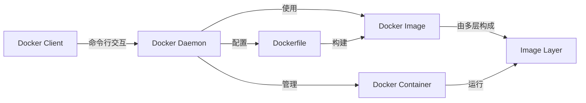

## 安装配置

### Windows 

https://blog.csdn.net/cn_ljr/article/details/132047516 （现在好像已经不适用，不需要这么麻烦，直接修改资源目录的配置即可）

### Kali

https://wiki.bafangwy.com/doc/642/

### Ubuntu

> https://www.cnblogs.com/ag-chen/p/18677273
> https://u.sb/debian-install-docker/

在Ubuntu中安装Docker，添加Docker官方 GPG key 失败，解决方案

> https://blog.csdn.net/sunchaoyiA/article/details/81231000

### 蚁景提供的脚本

https://gitee.com/yijingsec/LinuxEnvConfig

```shell
# 查看docker服务状态
systemctl status docker
# 启动docker服务
systemctl start docker
# 开启开机自启docker服务
systemctl enable docker
```

配置国内镜像源（不稳定，经常会变）

```shell
vim /etc/docker/daemon.json
```

```json
{
	"registry-mirrors": [
		"https://docker.1ms.run",
		"https://hub.rat.dev",
		"https://docker.1panel.live"
	]
}
```

```shell
# 重新加载加速器
systemctl daemon-reload
# 重启docker
systemctl restart docker
```

给 docker 配置网络代理 https://edu.yijinglab.com/post/270

## 基础介绍

- Docker Daemon（守护进程）
	- 宿主机上运行的后台服务，负责构建、运行和分发容器；
- Docker Client（客户端）
	- 与 Daemon 的交互界面，发送请求给 Daemon 以执行命令，如构建镜像、运行容器等；
- Docker Image（镜像）
	- 只读模版，包含运行容器所需的所有内容，代码、运行时、库、环境变量、配置文件；
	- 镜像是分层的，允许共享和重用；
- Docker Container（容器）
	- 镜像的运行实例，隔离的沙盒，拥有自己的文件熊、网络设置、进程空间等。



## 常用命令

### 镜像操作

```shell
docker search mysql

# 列出本地docker镜像
docker image ls -a
docker images -a

# 拉取镜像
docker image pull docker.io/library/hello-world:latest	# [指定仓库地址]
docker pull mysql:latest	# mysql:x.x

# 删除镜像
docker image rm hello-world	# 指定镜像名
docker rmi feb5d9fea6a5		# 指定镜像ID
docker rmi mysql:5.7
```

### 容器操作

```shell
# 创建并运行容器
docker run [option] image_name [command]	# 可选参数、镜像名、启动时执行的命令
docker run -id --name=centos7 centos:centos7
# 运行，若没镜像会去远程拉取

# 创建交互式容器
docker run -it --name=mycentos centos /bin/bash
# -i 交互式 -t 分配伪终端 --name 指定名称 打开bash
# exit 退出，容器也随之停止

# 守护式容器
docker run -dit --name=mycentos centos
# -d 守护模式，在后台运行； exit 退出，容器不会停止 

# 进入正在运行的容器
docker exec -it container_name_or_id command
# exec 在已运行的容器中执行命令 容器名或ID  进入后执行的第一个命令
docker exec -it mycentos /bin/bash
docker exec my_container ls /var/www/html

# 指定端口运行
docker run -d -p 80:80 medicean/vulapps:t_thinkphp_2
# -p 端口映射 宿主机端口:容器端口 可使用多个-p做多个端口映射

# 列出正在运行的容器
docker container ls

# 列出所有容器（包括停止的）
docker container ls --all

# （简洁命令）
docker ps	# 查看存在的容器
docker ps -a

docker run -id --name=demo centos:centos7 sleep 20
# 当20s过后，这个容器就会停止

# 停止正在运行的容器
docker container stop name_or_id
docker stop name_or_id

docker rm `docker ps -a -q` -f	# 强制删除所有容器（后门指令作为前面指令的参数）
# -q 静默模式

# 启动已停止的容器
docker container start name_or_id
docker start name_or_id

# 强制停止正在运行中的容器
docker container kill name_or_id
docker kill name_or_id

# 删除容器（需先停止）
docker container rm name_or_id
docker rm name_or_id
```

### 容器保存为镜像

```shell
# 更改过的容器创建为一个新的镜像
docker commit container_name image_name
```

### 镜像备份

```shell
# 将镜像保存为一个文件
docker save -o 保存的文件名 镜像名
# 这将创建一个包含镜像及其所有层的归档文件
```

### 镜像迁移

备份的镜像文件可以被拷贝到其他机器上

```shell
# 在目标机器上，使用docker load 来加载镜像
docker load -i 文件名
```

docker-compose 定义和运行多容器 Docker 应用程序

```shell
docker-compose up/down -d
# up 启动服务，根据docker-compose.yml文件中定义的服务创建启动容器
# down 停止并移除服务，停止多有由docker-compose.yml文件定义的服务的容器
# -d 后台运行
```